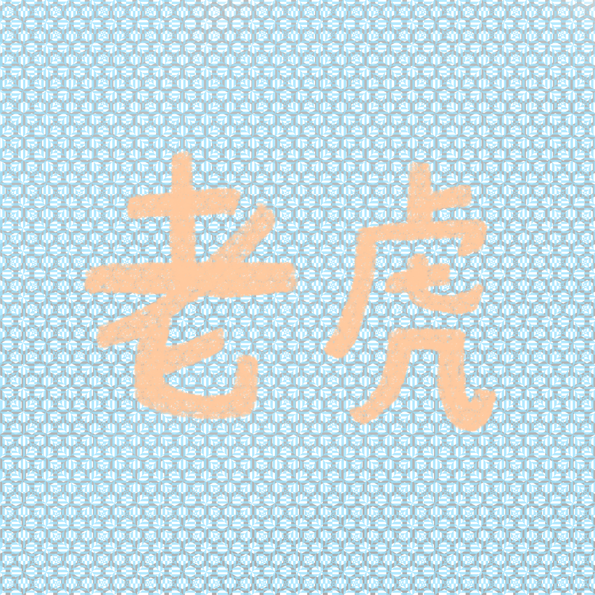
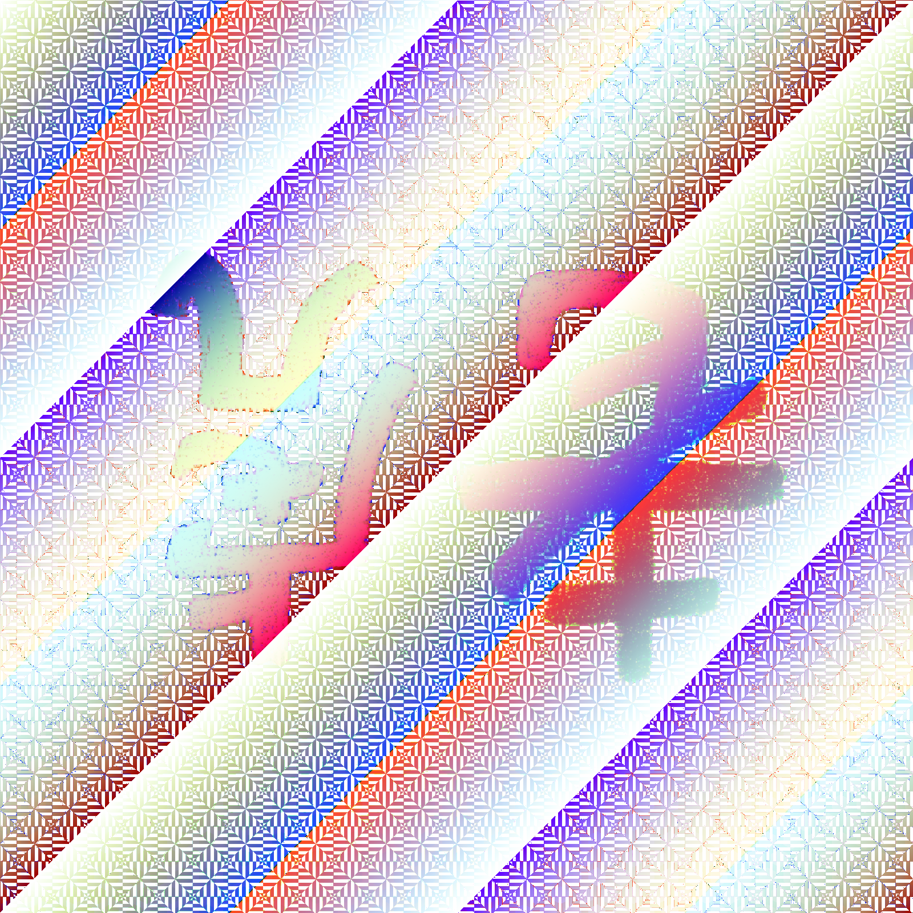

# Fastfor

- Category : crypto
- Difficulty : medium
- Final point value : 123
- Number of solves : 111

A funny crypto challenge where one had to find an image with a Fourier transform close to that of another image.

## Challenge description

Make the image different yet same!
https://fastfor.chall.pwnoh.io

Associated file : [check_hash.py](./check_hash.py)

## First inspection

We have a website with a *beautiful* image, and the possibility to upload a file.

After a few trials, it turns out you have to upload an image too. We try uploading the same image, or another image, we get "Hmmmm... don't think so".

By looking at the code for `check_hash.py`, we understand what are the requirements for the uploaded image :
- it must have the same shape (=dimensions) as the original image
- it must be different from the original image (sum of bitwise xor different from `0`)
- then it must be "close" to the original image. To compute the distance between the two images, the program takes there [Fourier transform](https://en.wikipedia.org/wiki/Discrete_Fourier_transform), then compute their respective [standard deviation](https://en.wikipedia.org/wiki/Standard_deviation), and compare them

## Playing with the Fourier transform

I first tried to do some operations on the Fourier transform that would preserve it's standard deviation. My idea was to keep the same components, but in a different order, by for instance transposing, mirroring or rotating the Fourier transform. I got some funny results, here is for instance the image that we obtain by flipping the Fourier transform along every axis, then inverting the Fourier transform :

Beautiful, isn't it ? But the problem is that when we take the inverted Fourier transform of the flipped matrix, some of the values will not be in the acceptable pixel range, and thus coerced back to `[0; 255]`. So if we take the Fourier transform of our image again, it won't have the same standard deviation ! We have to find something else.

## Solution

The solution was finally quite simple : rather than doing conservative transformations on the Fourier transform of the image, do them directly on the original image. That's what I did in this simple [script](./script.py), the transpose of the original image has indeed the same Fourier transform, and could consequently be uploaded to obtain the flag : `buckeye{D33p_w0Rk_N07_WhY_574ND4RD_d3V}`