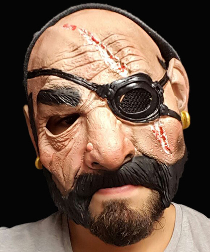
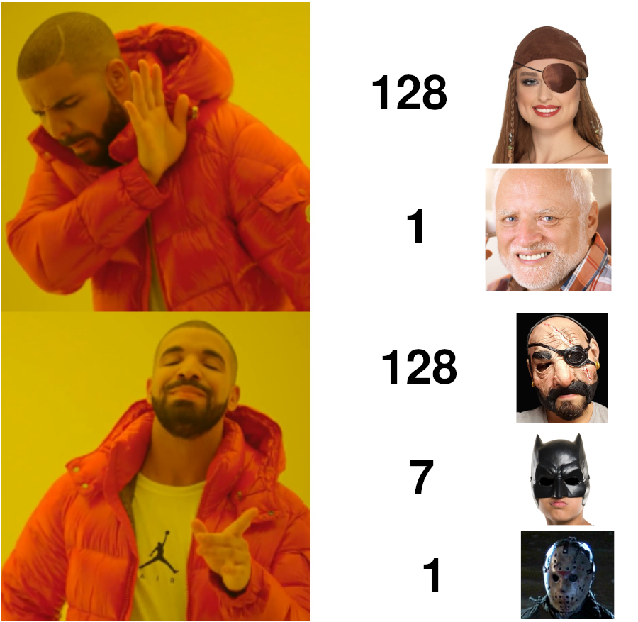

# FSCS 2022: Guess Me Too

https://hackropole.fr/fr/challenges/misc/fcsc2022-misc-guess-me-too/

## The server program

We'll start by analyzing the `guessmetoo.py` server file. We've got a function called `w` that calculate's the [Hamming weight](https://en.wikipedia.org/wiki/Hamming_weight) of it's input modulo two. Then a `game` function, that does the following:
- choose a secret number of `N=128` bits
- ask the user/player for `C=136` number, that must all be different from each other
- for each of these numbers, use it as a [mask](https://en.wikipedia.org/wiki/Mask_(computing)) to compute a checksum on the secret number
- randomly flip one of those checksum, before sending them to the player
- have the player guess the secret number

Finally, the main function plays `K=32` games and gives out the flag iff the player succeed in every of them. So, we'll have to find a way to always win this game.

## Simplified case: no bit flip

In order to start easy, I first modified the server file on my computer to remove the bit flip, and tried to solve the game in this setting. To this end, I started a [Python script](attack.py), and wrote the functions `mask_sample` and `interpret_mask_sample`. The method here is a bit naive and uses `129` bits of information where only `128` were necessary, but this is the first idea that came to my mind, maybe because I got carried out when I understood the server was doing checksums.

--- 

### *Apparté*: masks

A mask is a number that is AND-ed to another number to hide a part of this number. Each `0` in the mask will "hide" the corresponding bit in the masked number by turning it to `0`, whereas each `1` will let you see through the mask and keep the corresponding bit as it is. So a mask can be seen as an actual face mask, with the `1` being the holes for the eyes.

---

So, I made `128` masks full of ones, with only one `0` at position `i`, for `i = 0` to `127`. If they were actual masks, they would look like that:

And then, the last mask is full of `1`s, so it does the entire checksum of the secret number and looks like that:

So, to interpret the results, you can get the `i`-th bit by XORing the checksum of the `i`-th mask with the checksum of the "invisible" mask. You get a number that is a XOR of twice every bit, except the `i`-th tha appear only once, so the result is the `i`-th bit.

Then you would tell me that it seems over-complicated, and that I should just have made the opposite: `128` masks full of zeros, with only a `1` at position `i`. This would have been much easier, the `i`-th checksum would directly give you the `i`-th byte. Why haven't I done that? Probably because I started coding at my first though, without trying to find a better idea. Or maybe because I found the girl with an eye mask prettier.

## The actual game

Okay, now let's try to see what we can do in the case where there is an error. It is first important to notice that we know that there is **exactly** one error. So our job is to locate it.

We'll start with a better basis, and use one-bit masks for our `128` first bits of information. With theses masks, we can rebuild the secret number, but with probably one flipped bit inside. And it is now time to dive into the wonderful world of [checksums](https://en.wikipedia.org/wiki/Checksum) and [error correcting codes](https://en.wikipedia.org/wiki/Error_detection).

## The half-masks

Then, we've got `8` bits left. How can we use them to locate the position of the error? Let's first assume that the error will happen among the `128` first bits. My idea was to use dichotomy. We create a mask with one half of zeros and one half of ones, a bit like Batman's mask, but without the holes for the eyes:

We can apply this mask to our guess, and recompute the associated checksum. If we get a result different than the one given by the server, then the error is located in the "ones" half of the number. And if we get the same result, then the error is in the "zeros" side.

We can then reiterate with a mask having one quarter of zeros, then one quarter of ones, then one quarter of zeros, then one quarter of ones (no picture for this one, sorry). This will tell us in which quarter of the number the error is located.
Doing so recursively gives us the exact location of the error, after `log(128) = 7` steps! If you don't understand what the masks look like, have a look at [this spreadsheet I made to help me think](masks.ods). Sorry for the ugly boolean-to-int casts.

## The last bit

Ok, so we managed to build the number and locate the error, with only `128 + 7 = 135` bits instead of `136`! But wait, we assumed that the flipped bit was among the `128` firsts, what if it is among the half-masks? It would introduce and error inside our number instead of correcting one! So we have to use the last bit to determine wether the error is in the one-bits masks, or in the half-masks.

My first idea was to use Harold/the invisible mask as the last mask. In that case, when we've build the secret number, we can check it against the full checksum, and see wether it is flawed or not. BUT in the unlikely, yet possible, case in which the flipped bit is the last one, we'll think wrongfully that there is an error in our number, and subsequently flip one bit in a desperate hope to correct it, which would instead lead us to our doom.

Instead, we'll do a mask that is a XOR of all the half-masks. It is full of seemingly random holes, and can be found in the "Checksum" line of  [the spreadsheet](masks.ods).

Though it may not be obvious, it works exactly like the former one: we XOR every half-mask to create this last mask, so if there are no errors in the last `8` checksum, they should XOR to zero.
Okay, so now we know if an error happenened in the half-masks. And what if the error happens in the last mask? Well, we don't have to care, it means that there is no error in the first `128` one-bits masks, so the number we built is the secret number.

I implemented this method in the functions `sample_ec` and `interpret_ec` (EC stands for Error Correction).

## Conclusion

We can test these functions locally, then wrap it all up with `pwntools` to have our script actually communicate with the server, and finally get the flag!

Here is a graphical summary of my solution:

