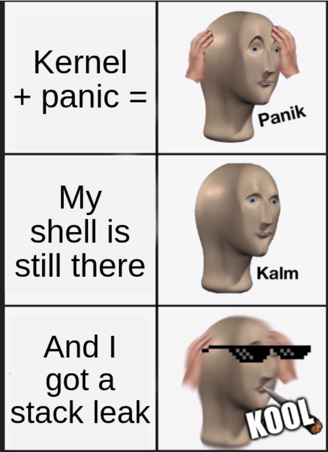
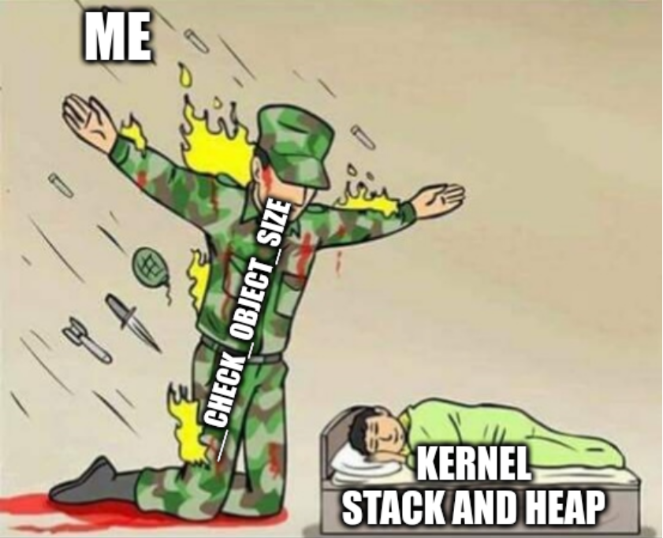

# FCSC 2023: ktruc

"ktruc" is the most difficult challenge that I solved during the FCSC 2023. It was a pwn challenge, which featured a vulnerable Linux Kernel Module (LKM) to exploit. I had never done kernel pwning before, so I am quite proud that I managed to solve this one, and I learned a lot while doing it.

## Learning Kernel pwning

I had to learn Kernel Module exploitation, so I started by reading articles and write-ups from previous CTF. Here are a few resources that I found particularly helpful:

- https://lkmidas.github.io/posts/20210123-linux-kernel-pwn-part-1/
- https://0x434b.dev/dabbling-with-linux-kernel-exploitation-ctf-challenges-to-learn-the-ropes/amp/
- https://pr0cf5.github.io/ctf/2020/03/09/the-plight-of-tty-in-the-linux-kernel.html
- https://www.youtube.com/watch?v=HtdriW7KVNE
- https://duasynt.com/blog/linux-kernel-heap-feng-shui-2022
- https://www.youtube.com/watch?v=hAJ2Q4-MNGU

Plus, special mention for https://elixir.bootlin.com/linux/latest/source, which makes it very convenient to read the Linux Kernel source code. Surprisingly, I found this code much easier to understand than the libc code.

## Setup

We are given an archive with a bunch of files:
```
ktruc-public/
├── docker-compose.yml
├── Dockerfile
└── public
    ├── initrd
    ├── kinetic-server-cloudimg-amd64-vmlinuz-generic
    ├── Makefile
    ├── proof-of-work.py
    ├── pwnme.c
    ├── pwnme.ko
    └── run.sh
```

Some of them are of minor importance: the [Dockerfile](./ktruc-public/Dockerfile) and [docker-compose.yml](./ktruc-public/docker-compose.yml) are only used in need to reproduce the exact same setup as the one on the server. The Dockerfile ends by running a [Python script](./ktruc-public/public/proof-of-work.py), which gives a Proof-of-work challenge to solve before running the actual challenge. The organizers provided us with a [template solving script](./ktruc-public/solve-pow.py) for this PoW. Let's see the other files now. Note that **I didn't include the heavy files in this repository**.

### [run.sh](./ktruc-public/public/run.sh)

The challenge uses [QEMU](https://www.qemu.org/) for system emulation. The standard "SMEP" and "SMAP" protections are enabled, which means that we won't be able to jump to userland code, nor to use userland data directly. There is also a 300s (5min) timeout, after which the emulator is killed. The flag is loaded as a virtual drive, and we will need to be root in order to read it.

In my debug setup, I modified this file to ease debugging. I removed the timeout, added the `-s` flag to allow remote debugging via GDB on port 1234, and disabled KASLR in order to be able to keep my breakpoints between debugging sessions. You can see the result [here](./debug-setup/run.sh). Of course, in my debug setup, I am running the `run.sh` file directly, without going through the PoW.

### kinetic-server-cloudimg-amd64-vmlinuz-generic

This is the kernel bzImage. We can decompress it into a vmlinux ELF File using [this script](https://raw.githubusercontent.com/torvalds/linux/master/scripts/extract-vmlinux). 
Now we can load it in `iaito` in case we need to read the assembly. We can also debug it, by running the `run.sh` script in one terminal window, and GDB in another one:
```
gdb vmlinux
[...]
(gdb) target remote :1234
```

### initrd

This file contains the file system loaded in the emulator. Running `file` on it informs us that it is compressed using `zstd`. We can decompress it to obtain a CPIO archive:
```
mdkdir initramfs
cp initrd ./initramfs
cd initramfs
zstd -d initrd -o initramfs.cpio
```
And then extract the files from this archive:
```
cpio -idm < initramfs.cpio
```

I wrote a "Hello world program" and I wanted to put it in this filesystem, then compress it back so that I can load it into QEMU:
```
cd initramfs
find . -print0 | cpio --null -ov --format=newc | zstd -9 > initramfs.cpio.zst
cd ..
mv initramfs/initramfs.cpio.zst .
```
But then QEMU was complaining about a file that was missing. It turned out that several files were missing, because the CPIO was actually made of two stacked CPIO files, and only the first one was properly extracted. So, I retrieved the missing files and added them to my `initramfs` folder. Among them, an [init script](./debug-setup/ctf) was responsible for dropping us into an unprivileged shell. I changed it for a privileged shell in my debugging setup in order to let me read the kernel symbols. When I finally managed to get my "Hello world", I wrote a [Makefile](./debug-setup/Makefile) to automate the compression of the filesystem. Note that I compile statically, to avoid problems with the libc in the virtual machine.

Now that we have a working debugging setup, let's have a look at the kernel module code.

## The vulnerability

The [pwnme](./ktruc-public/public/pwnme.c) module allows us to create buffers ("banks") of a given size, to write to them and to read from them. The interaction is done through a `/proc` entry, and `ioctl` is used to create new banks and to switch between the banks. The index of the current bank and the total number of banks are stored in global variables. We quickly notice an off-by-one error, present both in `ioctl_switch`:
```C
 static long ioctl_switch(const struct args_switch __user *ptr)
{
	struct args_switch args;

	if(copy_from_user(&args, ptr, sizeof(args)))
		return -EFAULT;

	if(args.index > count)
		return -EINVAL;

	index = args.index;
	return index;
}
```
and in `getData`:
```C
static int getData(void **data, size_t *length, off_t offset, size_t size)
{
    [...]

	// This can only happen during init (when count == 0)
	BUG_ON(index > count);

	[...]
}
```

So, if we set `index` to `count`, we should be able to manipulate an object located just after the boundary of our `banks` array. Let's write some wrappers for the `ioctl` interaction, and try this out. You can find [here](./debug-setup/poc.c) a small program that creates one bank, then attempt to read the bank at index 1. Here is what happens when I run it inside the VM:
```
$ /poc
[   19.650895] usercopy: Kernel memory exposure attempt detected from null address (offset 0, size 64)!
[   19.652684] kernel BUG at mm/usercopy.c:101!
[   19.655078] invalid opcode: 0000 [#1] PREEMPT SMP NOPTI
[   19.655999] CPU: 0 PID: 214 Comm: poc Tainted: G           OE     5.19.0-35-generic #36-Ubuntu
[   19.656862] Hardware name: QEMU Standard PC (i440FX + PIIX, 1996), BIOS Arch Linux 1.16.2-1-1 04/01/2014
[   19.657830] RIP: 0010:usercopy_abort+0x79/0x7b
[   19.659279] Code: 06 a2 51 48 0f 45 d6 48 89 c1 49 c7 c3 04 b5 02 a2 41 52 48 c7 c6 bf f1 00 a2 48 c7 c7 70 b4 02 a2 49 0f 45 f3 e8 f3 67 fe ff <0f> 0b 41 0f b6 d6 be 00 10 00 00 4f
[   19.660834] RSP: 0018:ffffad7c006f7d70 EFLAGS: 00000246
[   19.661460] RAX: 0000000000000058 RBX: 0000000000000000 RCX: 0000000000000000
[   19.662032] RDX: 0000000000000000 RSI: 0000000000000000 RDI: 0000000000000000
[   19.662619] RBP: ffffad7c006f7d88 R08: 0000000000000000 R09: 0000000000000000
[   19.663238] R10: 0000000000000000 R11: 0000000000000000 R12: 0000000000000001
[   19.663915] R13: 0000000000000040 R14: 0000000000000040 R15: ffffad7c006f7e78
[   19.664796] FS:  00000000005ab380(0000) GS:ffff89df5c800000(0000) knlGS:0000000000000000
[   19.665380] CS:  0010 DS: 0000 ES: 0000 CR0: 0000000080050033
[   19.665739] CR2: 0000000000470260 CR3: 0000000002a9c000 CR4: 00000000003006f0
[   19.666792] Call Trace:
[   19.668102]  <TASK>
[   19.668665]  __check_object_size.part.0.cold+0x4f/0x7f
[   19.669357]  __check_object_size+0x23/0x30
[   19.669854]  mod_read+0x6f/0xbf [pwnme]
[...]
Segmentation fault
$ 
```

Ok, several interesting things to notice here:
- a function named [`check_object_size`](https://elixir.bootlin.com/linux/v5.19/source/mm/usercopy.c#L212) prevented us from reading at address `0`
- this caused some kind of Kernel panic, but did not crash the Kernel, we still have access to a shell
- we obtained the value of the registers. Notably, the value of `RSP` gives us the approximate location of the stack, and the value of `GS` gives us the location of the reference canary



## Getting AAR/AAW primitives ?

Now, it could be nice to control where we are reading (or writing). For this, we *only* have to be in control of the 16 bytes located after our `banks` array: if we achieve this, we can choose the `*data` and `size` of the fictional last-plus-one element of the array. It's probably time to understand how `kmalloc` and `krealloc` actually work. The Kernel heap doesn't work like the glibc heap, it uses an allocator named "SLUB", and [this article](https://duasynt.com/blog/linux-kernel-heap-feng-shui-2022) taught me all that I needed to know about it. Here are the key insights that are relevant for our challenge:
- there are caches for different object sizes
- object of the same size get allocated to the same cache
- the order of filling for a given cache may be randomized

A bank has size `0x10`, so if we create `n` banks with a `data` buffer of size `n * 0x10`, then the `banks` array and the data buffers will end up in the same cache. If we are lucky, one of the `data` buffers will be located just after the `banks` array. We chose `n = 0x10`, and it worked most of the time. We implemented it in a function called `init_leak_stack`, in [pwn.c](./debug-setup/pwn.c). This function creates the banks, find the one that is just after the `banks` array (we name it the `cool_bank`), and leak the stack as seen before. To do so, it first writes zeros in the `0x10` first byte of each bank. If one of these banks is the `cool_bank`, then reading from the last-plus-one bank will not result in a crash, because reading with length `0` bypasses `__check_object_size` (see [here](https://elixir.bootlin.com/linux/v5.19/source/mm/usercopy.c#L218)). Now, we set the second `long` of each bank to `8` in turn, and attempt to read from the last-plus-one bank every time. When we reach the `cool_bank`, we will attempt to read `8` bytes at address `0`, so `__check_object_size` will stop us, and leak the stack. But the kernel does not crash, we can still run programs, our `banks` are still in the kernel memory, and we know which one is the `cool` one.

I wanted to be able to play a bit, so I made my exploit modular. I implemented some functions for reading and writing anywhere in the memory using the `cool_bank` (see `read_restrained` and `write_restrained`), and I used command line arguments to call them. So I could for instance read anywhere in the memory using this command:
```
$ ./pwn 2 <cool_bank> <addr> [<size>]
```
So I have my AAR/AAW, let's get root now! Oh wait. Do I really have AAR/AAW? I first tried to read the stack thanks to my stack leak, hoping to find pointers to the kernel base and to the heap on it, but something unexpected happened:
```
$ /pwn 2 0xb 0xffffb551406a7da0 0x40
[   39.041497] usercopy: Kernel memory exposure attempt detected from process stack (offset 40, size 64)!
[   39.045312] ------------[ cut here ]------------
[   39.048013] kernel BUG at mm/usercopy.c:101!
[   39.049904] invalid opcode: 0000 [#2] PREEMPT SMP NOPTI
[   39.051569] CPU: 0 PID: 215 Comm: pwn Tainted: G      D    OE     5.19.0-35-generic #36-Ubuntu
[   39.054070] Hardware name: QEMU Standard PC (i440FX + PIIX, 1996), BIOS Arch Linux 1.16.2-1-1 04/01/2014
[   39.057536] RIP: 0010:usercopy_abort+0x79/0x7b
[...]
```
It seems like `__check_object_size` does not only prevent you from reading at address `0`. It also prevents `copy_from_user` and `copy_to_user` from accessing
- the stack outside the current stack frame
- the kernel `.text` section
- some critical parts of some objects on the heap

By playing around with my "almost arbitrary address read primitive", I nevertheless managed to read some parts of the stack and leak pointers, but it was not very reliable
```
$ /pwn 2 0xb 0xffffb551406a7ea0 0x30
read returns 48
ffffb551406a7ec8
ffffffffc0281046
10
7dff9b83905b6e00
ffff9ae5c2f8e000
ffffb551406a7ee8
```

## Privilege elevation: unsuccessful ideas

I spent a long time trying to see what I could do with my primitives. In the write-ups, I found two classical way to get root in LKM exploitation:
- call `commit_creds(prepare_kernel_creds(0))`, then switch back to userland with `swapgs + iretq` or through a KPTI trampoline. This would require hijacking the execution flow, and since `SMEP` is enabled and the Kernel as a NX policy, the best way to do it is through ROPing. But `__check_object_size` will prevent us from overwriting the stack.
- change the `cred` of the current `task_struct`. For this we need to locate the `task_struct` on the heap, but when I tried to browse the heap, I was stopped every time by `__check_object_size`. I tried to script it in a C2 way, with a python script that would restart the `pwn` program when it crashes, but it was too slow and not reliable.

I was completely blocked by `__check_object_size`. I subsequently tried to get true AAR/AAW primitives, by exploiting a TTY struct (because I saw it a lot in write-ups), but once again, I could not reliably find my `tty_struct` in the memory because of `__check_object_size`. My unsuccessful attempts at elevating my privileges can still be found in `create_tty`, `place_needle_in_taskstruct`, `find_banks` and `register_sigsev`.



I spent my entire Wednesday on this part, I started to really hate `__check_object_size` (why does Linus have to make his Kernel so secure???). I was going to go to bed empty-handed, when I suddenly remembered another exploitation technique that I had read in write-ups.

## Abusing `modprobe`

This technique is very well explained [here](https://0x434b.dev/dabbling-with-linux-kernel-exploitation-ctf-challenges-to-learn-the-ropes/amp/). In a nutshell, when you try to execute a program, the kernel will look for an interpreter for this program, based on the magic (first bytes) of the program. If no interpreter is found, the kernel will try to automatically load some kernel modules that could help interpret the program. To this end, it calls `modprobe` in an userland process with root privileges. The trick is, it gets the path to `modprobe` through a global variable labeled `modprobe_path`, and this variable can be overwritten. So, if we:
- create a script that reads the flag to a file (`cat /dev/vda > /tmp/result && chmod 777 /tmp/result`)
- overwrite the `modprobe_path` with the path to our script
- try to execute a file with an unknown magic

Then the kernel will execute our script as root.

This attack is implemented in `attack_modprobe`. We tried it first without KASLR, by reading the address of `modprobe_path` in `/proc/kallsyms`. With KASLR still disabled, we leaked pointers to the kernel from the stack. We saw four of them, and we placed them in `potential_leaks`. We could then disable the KASLR and do our attack in three steps (yes, it is a bit manual, I could have scripted it):
- initialize the banks, find the `cool_bank` and leak the stack with `./pwn 0`
- attempt several times to read from the stack with `./pwn 2 <cool_bank> <stack_addr> <size>` until we find a pointer that has the same three nibbles as one of our `potential_leaks` (because the page size is `0x1000`)
- launch the "modprobe" attack with `./pwn 5 <cool_bank> <kernel_leak>`, which will use our leak to compute the actual address of `modprobe_path`, overwrite it and execute a dummy file with an unknown magic

And it works, we can then read our fake local flag in `/tmp/result`!

## Sending the exploit to the server

So far we have been creating our exploit locally by inserting our program into the `initrd`, but on the server this won't be possible. That's our last challenge: we need a way to upload our program to the server. Running `help` inside our VM informs us that `gzip` and `base32` are available commands, so let's use them! We write a [script](./debug-setup/attack.py), adapted from the PoW solving script, that convert our zipped exploit to base32, then send it chunk by chunk to the server, appending the chunks to a text file. We then ask `pwntools` to give us control over the shell, and we manually (yes, I could have scripted that too) decode the base32 and decompress the gzip file. We can then run our exploit as described above, and retrieve the flag.

## Conclusion

As I said in the introduction, I had never done kernel pwning before, and I started directly with a kernel heap challenge: in French, we would call this "apprendre sur le tas". It took me about 20 hours overall to do it, and I learned a lot on the way. Thanks to this challenge, I managed to rank 2nd among the seniors (21-25 y.o.) in the pwn category.