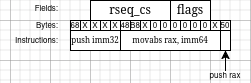

# Juste à temps

This challenge involved exploiting a Just-In-Time ("Juste à temps" in French) compiled calculator.

A vulnerability in the program allowed us to overflow the JIT compiled code into the Thread Local Storage page.
My exploit path involved the [`rseq`](https://elixir.bootlin.com/linux/v6.13.8/source/kernel/rseq.c) kernel feature, and 16 bits of bruteforce to get an address with the right bytes in it.
It was the most difficult pwn challenge of FCSC 2025, and I was very proud to obtain the first blood for it.

## Setup

We are given the compiled binary, its source code, the libc and ld it has to run with (GLIBC 2.41) and a docker setup (see [here](./handout/)).
As usual, we can use `patchelf` to make the binary use the provided libc and ld:

```
cp juste-a-temps patched
ln -s libc-2.41.so libc.so.6 
patchelf --set-rpath . ./patched 
patchelf --set-interpreter ./ld-2.41.so patched 
chmod u+x patched ld-2.41.so
```

The FCSC's FAQ indicated that this challenge was running on a VM with a different kernel as the other pwn challenge, so I set up a VM with the provided kernel and a Debian cloud `rootfs`, as indicated in the FAQ.
I set up an SSH server in this VM, and installed `gdb`, `pwntools`, and [bata24's fork of `gef`](https://github.com/bata24/gef).

## Analysis

The program looks like a basic calculator. It gives us the address of its JIT page, then let us enter math expressions and evaluates their result. Let's have a look at its source code. The source contains a `main` file, and three usual steps for a compiler: lexer, parser and JIT code production.

### [`main.c`](./handout/src/main.c)

The `main` function allocates the JIT page and prints its address, then reads the user input with `getline` in a loop.
For each user input, it first checks if this input is "clear\n", in which case the program restarts itself using `execv`, which is a quite unusual behavior. For any other input, it parses the output, compiles it and runs it. If the compiled code is larger than the JIT page, it calls a weird panic function, which prints an error message, sleeps for 3 seconds, and then exits the program with `_exit`. 

### [`lexer.c`](./handout/src/lexer.c)

The lexer recognizes a limited number of tokens: `(`, `)`, `+`, `-`, `*` and numbers.
Its implementation is straightforward, there is a single function called `lexer` which reads a token and returns the address of the end of the token.

Numbers are read in base 10 and stored as a `long` (64 bits). They can easily overflow, but this would only make the computations incorrect, and is not a vulnerability per se.

### [`parser.c`](./handout/src/parser.c)

A comment at the beginning of the file explains the grammar of the parser:

```
/* Grammar
 * expression = term (('+' | '-') term)*
 * term       = factor (('*' | '/') factor)*
 * factor     = number | '(' expression ')'
 * number     = [0-9]+
 *
 * TODO: oops, I forgot negative numbers were a thing xD
 *       you can do (0-n) to get a negative number
 */
```

The parser implementation is once again easy to understand, it builds an AST based on the tokens provided by the lexer, and properly takes into account the parentheses. New nodes in the AST are `malloc`ed, and properly freed in case of an error.

### [`jit.c`](./handout/src/jit.c)

Finally, the JIT turns the AST into assembly code. Operands are pushed and pop directly on the program's stack. Numbers are pushed using a different instruction depending on their size. Each operation pops its two operands from the stack into `rdx` and `rax`, computes the result into `rax`, then pushes it back on the stack. At the end of the compiled code, an epilogue pops the final value into `rax`, then returns.

## Hunting for the vulnerability

I did not see any vulnerability when reading the code. I tried to find a way to change the stack alignment, but the compiler makes sure that this never happens, by always getting an equal number of pushes and pops. I also tried to decompile the binary in Ghidra in order to get another view of the code, but still could not fin any vulnerability. So I made a break and started working on [Swift Encryptor](../SwiftEncryptor/) instead.

Once Swift Encryptor was solved, I came back to this challenge. I tried to fuzz the program using [AFL ++](https://aflplus.plus/), and somehow got some crashes, but they did not make sense, and the binary always told me "Could not parse expression" when I tried to feed it with one of the crashing inputs.

I noticed that the parser is recursive, so I thought I could overflow the stack with it. There wasn't any reason for it to be exploitable, but I tried anyway.
I sent "1+(1+(1+ ...))" with a very large number of ones, and observed what happened.
With 0x1000 `1`s, the computation happens as expected. With 0x10000, we have a Segmentation Fault due to a stack overflow. With 0x2000, the `panic` function is called, and the program exits. And with 0x3000...

```
*** stack smashing detected ***: terminated
```


That's unexpected. So I looked at it in GDB, and there I noticed that the JIT page was right before the TLS page! The "stack smashing detected" happened because the compiled code smashed the reference canary stored in the TLS. And by the way, since the libc is right after the TLS, and we know the address of the JIT page, then we also now the address of the libc. It was already past midnight, so I stopped working on the challenge and went to bed, persuaded that it would be simple to exploit it: smash [whatever data structure on the TLS as usual](https://github.com/nobodyisnobody/docs/tree/main/code.execution.on.last.libc/#5---code-execution-via-tls-storage-dtor_list-overwrite), and you get code execution. When I went to sleep, I did not expect at all that this would take me the entire next day...

The next day, I went on with my idea. I made sure that the JIT page is always right before the TLS, even in the VM. But then I quickly understood that the usual TLS approach will not work. If we overwrite the reference canary, no destructor will be called. And if we overwrite something else in the TLS, but not the canary, the `panic` function will be called, which calls `_exit` instead of `exit`, so no destructors either. I had a look at the GLIBC code for `write` and `sleep`, and noticed a mechanism called ["cancellation"](https://elixir.bootlin.com/glibc/glibc-2.41/source/nptl/cancellation.c#L85), which at some point involved ["unwinding"](https://elixir.bootlin.com/glibc/glibc-2.41/source/sysdeps/generic/unwind-resume.c#L48) and [calls to mangled pointers](https://elixir.bootlin.com/glibc/glibc-2.41/source/sysdeps/generic/unwind-link.h#L64). But the cancellation of a syscall seemed to be linked to debugging, and there was a big problem with this approach: the `PTR_MANGLE` cookie is located in TLS, **after** the reference canary. So, we can not overwrite it with a know value without overwriting the canary too and leading to "stack smashing detected".

### `rseq`

During my tests, I noticed something weird. When I was overwriting the canary, the program would most of the time terminate with `SIGABRT`, but it would rarely get a `SIGSEGV` instead. I investigated one of the SIGSEGV crashes with GDB, and could not see any reason for it to happen. So I wrote a small [C program](./poc/main.c) to investigate that more easily, in a setting similar to the JIT program, but with more control over what I was writing. I tried writing at different places in the TLS, and by binary search, I found out that writing junk at offset `0x688` in the TLS will always produce this segfault. Pushing the investigation further, I noticed that during a normal run, there is 0 at this offset, but some numbers at offset `0x680`. I put hardware watchpoints on these addresses, but they were never triggered. Weird...

I started to suspect that the kernel was responsible for it. Indeed, when running the program with `strace`, I could see that the SIGSEGV had [`si_code = SI_KERNEL`](https://unix.stackexchange.com/questions/71240/sigaction7-semantics-of-siginfo-ts-si-code-member#71268). And then I looked at the part of the `strace` log that concerned the TLS:

```
mmap(NULL, 12288, PROT_READ|PROT_WRITE, MAP_PRIVATE|MAP_ANONYMOUS, -1, 0) = 0x7aa1ca889000
arch_prctl(ARCH_SET_FS, 0x7aa1ca889740) = 0
set_tid_address(0x7aa1ca889a10)         = 18520
set_robust_list(0x7aa1ca889a20, 24)     = 0
rseq(0x7aa1ca889680, 0x20, 0, 0x53053053) = 0
```

So, there is a syscall called `rseq` that takes our TLS address as argument. Let's have a look at what this syscall does:

```
$ man rseq
No manual entry for rseq
```


Looking it up online, I found [this article](https://www.efficios.com/blog/2019/02/08/linux-restartable-sequences/) from the author of the `rseq` mechanism in the Linux Kernel. I learned that:
- `rseq` is an efficient concurrency control mechanism helped by the kernel
- a thread can define a critical section, such that an abort handler is called when the thread is preempted or receives a signal while in the critical section
- the abort handler must not be in the critical section

That seems very promising. I was quite sure that this was the mechanism we had to exploit: this was coherent with the `sleep(3)` in the `panic` function, letting the thread enough time to be preempted.

So I looked at the [`rseq` source code](https://elixir.bootlin.com/linux/v6.13.8/source/kernel/rseq.c) in the Kernel, and tried to make a PoC of it in my C program. It took me quite some time, because I made the mistake of trusting the blog post from the author over the source code, while there was two major differences between the two:
- the blog post says that syscalls are not allowed within the critical section, but in the kernel they are allowed
- the blog posts identifies the critical section with its start and end addresses, while the kernel uses its start address and size

In the end I was able to trigger the abort handler in my C code, while being in similar conditions as in the vulnerable program. I verified that this also worked in the VM.
Here are some details about the required setup.


The TLS contains a `rseq` structure at offset `0x680`, with the following definition:
```c
struct rseq {
	__u32 cpu_id_start;
	__u32 cpu_id;
	__u64 rseq_cs;
	__u32 flags;
	__u32 node_id;
	__u32 mm_cid;
	char end[];
} __attribute__((aligned(4 * sizeof(__u64))));
```

The interesting field is `rseq_cs`, which is a pointer to a `rseq_cs` structure defining the critical section:
```c
struct rseq_cs {
	/* Version of this structure. */
	__u32 version;
	/* enum rseq_cs_flags */
	__u32 flags;
	__u64 start_ip;
	/* Offset from start_ip. */
	__u64 post_commit_offset;
	__u64 abort_ip;
} __attribute__((aligned(4 * sizeof(__u64))));
```

So, we need to craft a `rseq_cs` structure somewhere, with `[start_ip; start_ip + post_commit_offset]` covering the libc `.text` section (where the `sleep` call happens), and `abort_ip` being the address we want to call. Then we must overwrite the `rseq_cs` pointer in the TLS to make it point to this crafted structure, and that's a win. However, if we make mistakes when crafting the structure (e.g. `post_commit_offset` too big, `abort_ip` within the critical section...), we simply receive a SIGSEGV from the kernel, without any explanation, which makes it difficult to debug. I thought I could use the provided VM to debug what was happening on the kernel, but the hardening made it difficult (no `/proc/kallsyms` :'( ).

I noticed in the code that the abort handler must be preceded by a valid "signature" as a measure to prevent attacks. There is no crypto here, the "signature" is always [`0x53053053`](https://elixir.bootlin.com/glibc/glibc-2.41/source/sysdeps/unix/sysv/linux/x86/bits/rseq.h#L30), in order to prevent code reuse attacks. But this should not be a problem for use, since we have a RWX page.

## Exploit

Now we have a clear exploit path: build a shellcode and a `rseq_cs` in the RWX page, then overwrite the `rseq_cs` pointer in the TLS. But once again, everything did not go as intended.

### Building a shellcode

Let's start with the first question: how do we build a shellcode, when we can only emit `push`, `pop`, `movabs`, `add`, `sub` and `mul` instructions?
Fortunately, there is a technique well known from browser exploitation: embedding opcodes in immediates. To understand it, let's take an example. Consider the following bytes and their disassembly:

```
0:  48 b8 31 c0 31 ff 5e    movabs rax,0x50f5a5eff31c031
7:  5a 0f 05 
```

This is a `movabs` instruction, that we could generate with our JIT compiler. In it's compiled form, it is made by the `48B8` opcode, followed by the 8-bytes immediate in little-endian. But if we disassemble from the third byte, we get the following result:

```
0:  31 c0                   xor    eax,eax
2:  31 ff                   xor    edi,edi
4:  5e                      pop    rsi
5:  5a                      pop    rdx
6:  0f 05                   syscall 
```

So, we can actually hide other opcodes inside the immediates of a `movabs` instruction, and run them by jumping at the right offset. We are however limited to 8 bytes, then the next instruction starts, and we are aligned with the original instructions again. But there is another trick: leap frog ("saute-mout~~h~~on" in French). We can write 6 bytes of instructions, then replace the last two bytes by a `jmp` instruction, jumping over the next opcode and landing in the next immediate. I used this technique to build a minimal shellcode that only performs a `read` on its own memory, so that I could then send a bigger shellcode on `stdin`. And I made the shellcode start with `0x53053053`, to validate the signature check. To emit my shellcode, I send the following computation:

```
(282599988952117331+(282321603791344177+(282422755733799144+282478349875396657)))
```
This results in the following assembly being emitted:
```
   0x79b7f5c7d000:      movabs rax,0x3ebff3153053053
   0x79b7f5c7d00a:      push   rax
   0x79b7f5c7d00b:      movabs rax,0x3eb0200ba66d231
   0x79b7f5c7d015:      push   rax
   0x79b7f5c7d016:      movabs rax,0x3eb5e00000000e8
   0x79b7f5c7d020:      push   rax
   0x79b7f5c7d021:      movabs rax,0x3eb9090050fc031
   0x79b7f5c7d02b:      push   rax
   0x79b7f5c7d02c:      pop    rdx
   0x79b7f5c7d02d:      pop    rax
   0x79b7f5c7d02e:      add    rax,rdx
   0x79b7f5c7d031:      push   rax
   0x79b7f5c7d032:      pop    rdx
   0x79b7f5c7d033:      pop    rax
   0x79b7f5c7d034:      add    rax,rdx
   0x79b7f5c7d037:      push   rax
   0x79b7f5c7d038:      pop    rdx
   0x79b7f5c7d039:      pop    rax
   0x79b7f5c7d03a:      add    rax,rdx
   0x79b7f5c7d03d:      push   rax
```
At offset 2, we have the signature:
```
   0x79b7f5c7d002: 0x53053053
```

And then the shellcode right after:
```
   0x79b7f5c7d006:      xor    edi,edi
   0x79b7f5c7d008:      jmp    0x79b7f5c7d00d
   ...
   0x79b7f5c7d00d:      xor    edx,edx
   0x79b7f5c7d00f:      mov    dx,0x200
   0x79b7f5c7d013:      jmp    0x79b7f5c7d018
   ...
   0x79b7f5c7d018:      call   0x79b7f5c7d01d
   0x79b7f5c7d01d:      pop    rsi
   0x79b7f5c7d01e:      jmp    0x79b7f5c7d023
   ...
   0x79b7f5c7d023:      xor    eax,eax
   0x79b7f5c7d025:      syscall
```

Between each shellcode chunk, we have a jump of three bytes, to go over the `push rax` and the `48B8` of the next `movabs`.

### Crafting `rseq_cs`

Now, we can use the same technique of placing arbitrary bytes in the immediates of `movabs` to craft a `rseq_cs` structure in the RWX page too. It is actually not that easy, because some constraints must be fulfilled:
- `version` is checked in the kernel and must be set to 0 (over 4 bytes)
- `flags` are checked too, and I **misread the check** at that time, more on it later
- `start_ip` must be a valid address, preferably near the libc. There is a bit of flexibility on the exact address we use, as long as the relevant part of the libc's `.text` is covered
- `post_commit_offset` must not be too big. By trial and error on my C test program, I found that it must have its 5 most significant nibbles (2.5 most significant bytes) set to 0.
- `abort_ip` must be within our RWX page to point to our shellcode. We once again have some flexibility, because we can place the shellcode anywhere in the RWX page


Fulfilling these constraints was not that easy, because we always control at most 8 successive bytes (immediate of `movabs`), and then we have the prefix of the next instruction which must be `6A` (8-bit push), `68` (32-bit push) or `48B8` (`movabs`). In the case of `movabs`, the 8 bytes immediates is followed by a `50` (`push rax`). We add to this that, due to the way the code is generated, the immediate of a 32-bit `push` must be at least `0x80` (else it would be emitted as an 8-bit push), and the immediate of `movabs` must be at least `0x80000000` (else it would be emitted as a 32-bit push).

I spent some time on paper trying to find a suitable layout, taking into account the possibility of bruteforcing until the ASLR gives us suitable bytes in some places. I will spare you my ugly drawings, but in the end, I found a suitable layout. Then I overwrote the `rseq_cs` pointer in the TLS... but it did not work.

### More `rseq` exploration

Everything seemed perfect with my layout, and yet I was still getting `SIGSEGV` from the kernel.
So I did more tests with my C program, and realized that the `flags` field must be zero too, both in `rseq` and `rseq_cs`. This was not obvious from the [source code](https://elixir.bootlin.com/linux/v6.13.8/source/kernel/rseq.c#L203), the check is a bit weird, and probably comes from the fact that these flags were deprecated. So, in `rseq_cs`, both `version` and `flags` must be set to 0 in order for the structure to be valid. And this is highly problematic, because they are both 32 bits fields, and next to each other, so we need to set 8 consecutive bytes to zero. The only way to do this would be to use a `movabs 0`, but the JIT does not let us generate it, and would use an 8-bit push instead.

When I realize that, it was around 6 pm, and I really thought that the whole `rseq` approach was impossible, and that I just spent my entire day inside a rabbit hole.


### Final exploit

But then a new idea came to my mind. The input is stored in the `getline` buffer in the heap, and we do not know the address of the heap. However, if our input is big enough, `malloc` will use `mmap` to allocate the chunk instead of using the heap, in which case we would know the address of the buffer! I tried it, and managed to reliably place the `getline` buffer right before the JIT page. I can thus write the `rseq_cs` as raw bytes just after my parsable input, and I will know its address.

But the game isn't over yet. While digging into `rseq`, I found that the `flags` field of the `rseq` structure on the TLS must be set to 0 too. So we must have 6 consecutive null bytes (2 MSB of the `rseq_cs` field + 4 bytes of flags), which can only be achieved with `movabs`. The best layout I could find for it is the following:



This layout requires that some bytes in the address of `req_cs` have a specific value (`48B8`).
So to achieve this, we have to bruteforce until the ASLR makes it happen.
Fortunately, the program makes it easy to bruteforce the address, thanks to the "clear" command causing it to execute itself again. I measured about 45 seconds for bruteforcing 12 bits on the remote, so the bruteforce of 16 bits should take less than 15 min, which is doable. So I tried, and after a few fixes in my script to improve its stability, I finally got a flag, and a first blood! The final exploit can be found [here](./exploit.py).

## Conclusion

This challenge was crazy, I spent the whole day in the emotional rollercoaster, thinking that I was close to flag, then discovering a new problem. I did not suspect that a kernel mechanism could give us code execution in userland. I am very proud that I obtained the first blood for this one. Kudos to XeR for the challenge!