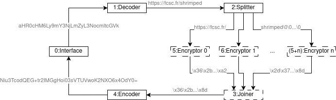
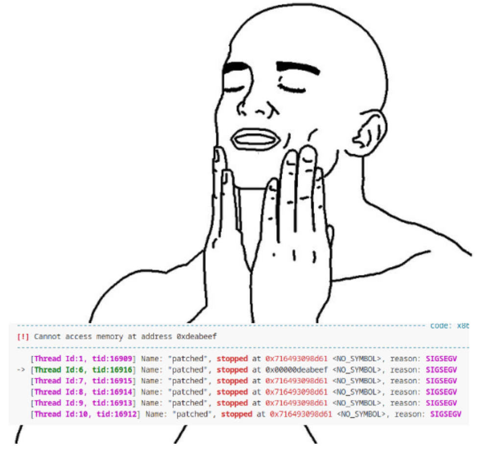
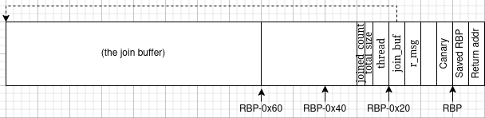

# Swift Encryptor

In this challenge, we have to exploit a multithreaded program that "encrypts" our inputs.
This program is made of multiple thread communicating with each other through a messaging system.
An integer overflow in one of these threads allows sending unexpected messages to other threads.
Using this primitive, I was able to leak a heap address, then a libc address thanks to a race condition, and finally to ROP in one of the threads to obtain a shell.

## Setup

We are given the compiled binary, its source code, and a docker setup (see [here](./handout/)).
First thing to do is to get a debug setup as close as possible to the remote, by retrieving the libc and ld files from the docker and patching the executable:

```
docker compose up -d
docker cp swift-encryptor-swift-encryptor-1:/lib/x86_64-linux-gnu/libc.so.6 .
docker cp swift-encryptor-swift-encryptor-1:/lib/x86_64-linux-gnu/ld-linux-x86-64.so.2 .
cp swift-encryptor patched
patchelf --set-rpath . ./patched
patchelf --set-interpreter ./ld-linux-x86-64.so.2 ./patched
chmod u+x patched ld-linux-x86-64.so.2
```

We can now run the patched binary with the right libc and ld. When we try to debug the program, however, GDB tells us:

```
warning: Expected absolute pathname for libpthread in the inferior, but got ./libc.so.6.
warning: Unable to find libthread_db matching inferior's thread library, thread debugging will not be available.
```

Since the program is multithreaded, it would be great to be able to debug the threads. So we retrieve `libthread_db.so.1` from the docker, the same way as we did for libc and ld, and then let GDB load it with

```
set libthread-db-search-path .
```

And now the debugging of threads works.

## Analyzing the program

We start playing with the program to observe its behavior:

```
$ ./patched
┌──────────────────────────────────────────┐
│┏━┛┃┃┃┛┏━┛━┏┛  ┏━┛┏━ ┏━┛┏━┃┃ ┃┏━┃━┏┛┏━┃┏━┃│
│━━┃┃┃┃┃┏━┛ ┃   ┏━┛┃ ┃┃  ┏┏┛━┏┛┏━┛ ┃ ┃ ┃┏┏┛│
│━━┛━━┛┛┛   ┛   ━━┛┛ ┛━━┛┛ ┛ ┛ ┛   ┛ ━━┛┛ ┛│
└──────────────────────────────────────────┘
> hello
[interface] OK
[decoder] Invalid base64
> AAAA
[interface] OK
[decoder] OK
[splitter] OK
[joiner] OK
[encoder] Xl/DPbknb27Y1c7rHg51jQ==
> 
```

Looks like the program expects a base64-encoded message, and returns another base64-encoded message, apparently meaningless. Let's have a look at the source code. I was afraid it would be coded in Swift (hinted from the name of the challenge), but hopefully it's good old C.

### [`main.c`](./handout/src/main.c)

The `main` is very short, it makes the I/O unbuffered, runs a command with `system`, then creates some threads, waits for the `interface` thread to join, and finally destroys all threads and exits. Not much to see here. Let's see how the threads are managed.

### [`thread.c`](./handout/src/thread.c)

This file defines functions for creating and destroying threads, and for passing messages between the threads. We notice that the created threads are stored in two arrays: a static array `MAIN_THREADS`, holding the "interface", "decoder", "splitter", "joiner" and "encoder" threads, and a dynamic array `WORKERS`, storing the other threads. Every thread is identified by an `id`, with `MAIN_THREADS` holding the threads with `id` 0 to 4 and `WORKERS` holding the rest.

### [`interface.c`](./handout/src/interface.c)

The interface thread reads an input from the `stdin`, sends it to the decoder, and then prints messages received from other threads, until it receives a message starting with `\x01`, at which point it goes back to the beginning and prompts the user again for an input. We can see that the maximum message size is 0x4000, let's have a look at what happens if we send a large input:

```
$ python -c "print('A'*0x3000)" | ./patched
┌──────────────────────────────────────────┐
│┏━┛┃┃┃┛┏━┛━┏┛  ┏━┛┏━ ┏━┛┏━┃┃ ┃┏━┃━┏┛┏━┃┏━┃│
│━━┃┃┃┃┃┏━┛ ┃   ┏━┛┃ ┃┃  ┏┏┛━┏┛┏━┛ ┃ ┃ ┃┏┏┛│
│━━┛━━┛┛┛   ┛   ━━┛┛ ┛━━┛┛ ┛ ┛ ┛   ┛ ━━┛┛ ┛│
└──────────────────────────────────────────┘
> [interface] OK
[decoder] OK
[splitter] 
[splitter] 
[splitter] OK
```

Interesting, we receive several empty messages from the splitter, and then the program hangs... We'll keep that in mind.

### [`decoder.c`](./handout/src/decoder.c)

The decoder performs a base64 decoding of the input received from the interface.
I did not want to audit the base64 code, so I just assumed it was correct, and hoped I would find a bug somewhere else. If the decoding succeeds, the decoder acknowledges to the interface and send the decoded result to the splitter.

### [`splitter.c`](./handout/src/splitter.c)

Here it becomes interesting.
When the splitter receives the input from the decoder, it kills any remaining encryptor or joiner thread, then creates a new joiner thread and as many encryptors (stored in `WORKERS`) as there are 0x10-blocks in the input. It then sends each block to a different encryptor, and acknowledges to the interface.

We notice a vulnerability in this code: there can be up to `0x4000//0x10 = 0x400` workers, but the `dst` field of message is a `u_char`, so it can be at most `0xff`. We thus have an **integer overflow**, leading to the input blocks starting from `0x100` being sent to the wrong thread. This explains why the interface received blank messages from the splitter when the input was too long: it simply received messages destined to the workers `0x100` and `0x200`. That's very interesting, this vulnerability should allow us to **send arbitrary messages to any thread**. We'll keep that in mind for later.

### [`encryptor.c`](./handout/src/encryptor.c)

The encryptor is simple, it "encrypts" the chunk received from the splitter, then sends the result to the joiner. We notice that it prefixes the encrypted block by its index in a `u_short`, thus identifying the offset of the block within the message. The encryption is simply a XOR with a static key.

### [`joiner.c`](./handout/src/encryptor.c)

First red flag, the joiner allocates a buffer on the stack with `alloca`.
It does not seem to be exploitable for an int overflow, because the size of the allocation is controlled by the worker count, itself based on the size of the input.

The joiner receives chunks of encrypted data from the workers, and places them in its stack buffer, **based on the offset read from the message**, and **without any bound check**. That's very interesting, it means that, by sending a crafted message with an invalid offset, we could write a chunk of `0xe` (`0x10-2`) bytes to any 0x10-aligned offset in the stack.

Once the joiner has collected as many chunks as there are workers, it acknowledges to the interface, then sends the full encrypted message to the encoder.

### [`encoder.c`](./handout/src/encoder.c)

The encoder performs a base64 encoding of the messages received from the joiner, and sends the result to the interface. Once again, I was too lazy to audit the base64 encoding code itself. We notice that **the size of the message to encode is read from the message itself**, which could lead to weird behaviors if the encoder receives a malformed message.

### Recap

That was a lot of a code, all of this for a simple XOR encryption... I drew a figure to schematize the functioning of the program. The joiner and workers threads are dashed to indicate that they are created and destroyed by the splitter, in opposition with the other threads, which live during the entire run.



And we noticed the following points:
- the `dst` of messages sent from the joiner to the workers overflows if the input size is greater than 0x1000
- this allows us to send 0x10-long messages to any thread
- when the joiner receives a chunk, it does not do any bound checks on its offset and writes it to its stack
- when the encoder receives a message, it trusts the indicated size of the message

Now, time to pwn!

## Exploit

### Controlling RIP

The unchecked offset in the joiner thread should allow us to get code execution through ROP.
Let's try this out!

Looking at the stack in GDB, I found that writing a chunk at offset `workers_count + 6` in the joiner should smash the saved `rbp` and saved `rip`. So, I wrote some helpers to send and receive the data, and then I wrote a `joiner_write` function to build a payload allowing to send our forged message to the joiner.
In order to send a message to the joiner, we have to also send one to the interface, decoder and splitter, because their index is lower as the one of the decoder. We make sure these messages are innocuous :
- the interface simply prints what it receives, we can send anything
- we begin the decoder's message with a null byte, so that `enc_size` is 0 and the decoder does not do anything
- we begin the splitter's message with two null bytes, so that `data_size` is 0 and the splitter does not do anything

I used this function to overwrite the return address with `0xdeadbeef`, and tried it, but the program just hung. I quickly understood why: when we use the integer overflow in the splitter, a few messages will not be sent to the workers (because they are sent to other threads), and the joiner will not receive enough messages from the workers. Thus, the `joined_count == WORKERS_COUNT` condition will never be satisfied in the joiner, and the joiner will not return.

Fortunately, I found a solution: if we place `\x01` at the beginning of the message for the interface, the interface will believe it is the final message from the encoder, and will thus offer us to encrypt a new string. Sending a random base64 string will cause the splitter to terminate the currently running joiner by setting its `stop` field to 1, thus making the joiner return. I modified my `joiner_write` function in order to be able to send the right message to the interface, and got it to segfault.



### Getting leaks

Great, we can jump anywhere, but where do we want to jump?
We need to leak some addresses.
To obtain a first leak, I used a forged message to the encoder.
The encoder reads the first two bytes of a message to know its size, so by sending a message to the encoder with a large size, we can dump whatever is in memory after the message.
Let's try it out:
```
[DEBUG] Receiving :
    00000000  44 44 44 44  44 44 44 44  44 44 44 44  44 44 00 00  │DDDD│DDDD│DDDD│DD··│
    00000010  00 00 00 00  00 00 00 00  00 00 00 00  35 00 00 00  │····│····│····│5···│
    00000020  00 00 00 00  1b 80 73 90  07 00 00 00  0d ed a0 99  │····│··s·│····│····│
    00000030  94 ce a6 3d  41 41 41 41  41 41 41 41  41 41 00 00  │···=│AAAA│AAAA│AA··│
    00000040  00 00 00 00  00 00 00 00  00 00 00 00  35 00 00 00  │····│····│····│5···│
    00000050  00 00 00 00  9b 38 72 a8  00 79 00 00  0d ed a0 99  │····│·8r·│·y··│····│
    00000060  94 ce a6 3d  41 41 41 41  41 41 41 41  41 41 00 00  │···=│AAAA│AAAA│AA··│
    00000070  00 00 00 00  00 00 00 00  00 00 00 00  35 00 00 00  │····│····│····│5···│
    00000080  00 00 00 00  eb 3c 72 a8  00 79 00 00  0d ed a0 99  │····│·<r·│·y··│····│
    00000090  94 ce a6 3d  41 41 41 41  41 41 41 41  41 41 00 00  │···=│AAAA│AAAA│AA··│
    000000a0  00 00 00 00  00 00 00 00  00 00 00 00  35 00 00 00  │····│····│····│5···│
    000000b0  00 00 00 00  9b 37 72 a8  00 79 00 00  02 f9 41 41  │····│·7r·│·y··│··AA│
    000000c0  41 41 41 41  41 41 41 41  41 41 41 41  41 41 00 00  │AAAA│AAAA│AAAA│AA··│
    000000d0  00 00 00 00  00 00 00 00  00 00 00 00  35 00 00 00  │····│····│····│5···│
    000000e0  00 00 00 00  9b 35 72 a8  00 79 00 00  0d ed a0 99  │····│·5r·│·y··│····│
```
It looks like a heap, with chunk sizes, [Safe-Linking](https://ir0nstone.gitbook.io/notes/binexp/heap/safe-linking)-protected `forward` pointers, and [tcache keys](https://ir0nstone.gitbook.io/notes/binexp/heap/tcache-keys).
In GDB, we can see that this heap is not in the usual heap region, but in a mmaped area. This is confirmed by the chunk sizes, which have the `NON_MAIN_ARENA` flag set. This is probably due to the multithreading situation, where the threads create their own heap to avoid locks on the main heap.
We can get the address of this heap by finding a place where the `NULL` pointer is protected by Safe-Linking, in this example this is `1b 80 73 90  07 00 00 00` at offset 0x24. The existence and position of such a leak depends on the order in which the messages were sent and freed, which is random due to multithreading, so we perform this leak several times until we find it. We thus have the address of a mmaped heap.

### Leaking libc

We now want to get the address of the libc.
Unfortunately, it seems that this heap does not contain any pointer to the libc, so we'll have to find another way.

#### Idea 1: offset from the heap

My first thought was that both this heap and the libc are mmaped, so they can not be far away.
Let's have a look at it in GDB:
```
0x00007dba0c000000 0x00007dba0c021000 0x0000000000021000 0x0000000000000000 rw- 
0x00007dba0c021000 0x00007dba10000000 0x0000000003fdf000 0x0000000000000000 --- 
0x00007dba10000000 0x00007dba10021000 0x0000000000021000 0x0000000000000000 rw- 
0x00007dba10021000 0x00007dba14000000 0x0000000003fdf000 0x0000000000000000 --- 
0x00007dba147fa000 0x00007dba147fb000 0x0000000000001000 0x0000000000000000 --- 
0x00007dba147fb000 0x00007dba14ffb000 0x0000000000800000 0x0000000000000000 rw- 
0x00007dba14ffb000 0x00007dba14ffc000 0x0000000000001000 0x0000000000000000 --- 
0x00007dba14ffc000 0x00007dba157fc000 0x0000000000800000 0x0000000000000000 rw- <tls-th7><stack-th7>
0x00007dba157fc000 0x00007dba157fd000 0x0000000000001000 0x0000000000000000 --- 
0x00007dba157fd000 0x00007dba15ffd000 0x0000000000800000 0x0000000000000000 rw- <tls-th8><stack-th8>
0x00007dba15ffd000 0x00007dba15ffe000 0x0000000000001000 0x0000000000000000 --- 
0x00007dba15ffe000 0x00007dba167fe000 0x0000000000800000 0x0000000000000000 rw- <tls-th9><stack-th9>
0x00007dba167fe000 0x00007dba167ff000 0x0000000000001000 0x0000000000000000 --- 
0x00007dba167ff000 0x00007dba16fff000 0x0000000000800000 0x0000000000000000 rw- <tls-th10><stack-th10>
0x00007dba16fff000 0x00007dba17000000 0x0000000000001000 0x0000000000000000 --- 
0x00007dba17000000 0x00007dba17800000 0x0000000000800000 0x0000000000000000 rw- <tls-th11><stack-th11>  <-  $rdi, $r14, $r15
0x00007dba17800000 0x00007dba17828000 0x0000000000028000 0x0000000000000000 r-- ./libc.so.6
```

Here, the first line is our leaked heap, the last is libc.
They are indeed quite close, in between we find a second heap and the stack of some threads, all of them interleaved with guard pages.
Unfortunately, the number of thread stacks is not consistent across executions, and there is a blank space of a random size between the second heap and the thread stacks. We could solve this with a bit of bruteforce, but it did not seem to succeed.

#### Idea 2: stack of `joiner`

Looking at the joiner, we notice that it sends `total_size` of data to the encoder, where `total_size` is a local variable, so I thought I could use my stack-smashing primitive to increase it, and make the joiner leak what is after its buffer. This would require satisfying the `joiner_count == WORKERS_COUNT` condition despite the missing messages, but `joiner_count` is a local variable too, so we could overwrite it too in order to satisfy the condition. To study the feasibility of this, I read the disassembly of the function and drew a representation of its stack on paper. Here is a numerical version of my drawing:



We overwrite by chunks of 0xe with a 0x10 alignment, since the first two bytes of a message correspond to the offset at which we write, so we can overwrite `joined_count` and `total_size` simultaneously. This would also smash `thread`, but it is not used anymore once the `joiner_count == WORKERS_COUNT` is satisfied, so we can write overwrite it without problems. I did this overwrite with the right `joined_count` and a big `total_size`... but did not obtain any leak, and instead got the exact same about of byte that I input, as if I did not overwrite `total_size`. So I read the source code again, and noticed a line that I missed before:
```c
if (joined_count == WORKERS_COUNT) {
        s_msg = create_msg(TID_JOINER, TID_INTERFACE, sizeof(OKMSG)+2);
        s_msg->data[0] = 0;
        strncpy(s_msg->data+1, OKMSG, sizeof(OKMSG)+1);
        send_msg(s_msg);

        total_size = WORKERS_COUNT * BLOCK_SIZE;
        s_msg = create_msg(TID_JOINER, TID_ENCODER, total_size+2);
        *((u_short*)s_msg->data) = total_size;
        memcpy(s_msg->data+2, join_buf, total_size);
        send_msg(s_msg);
        return NULL;
      }
```
`total_size` is computed again before sending the message, making my overwrite useless...


#### Idea 3: overwrite `join_buffer`

However, trying this gave me a new idea: I could overwrite the `join_buffer` on the stack to make it point somewhere else. There was a second heap right after the one I leaked, and I found a libc pointer in it at a fixed offset, so this could be a good target.
Overwriting `join_buffer` forces us to also overwrite `r_msg`, but we can set it to 0 so that `free` does not complain. However, if we overwrite `join_buffer`, the next chunks will be written to the new location instead of the stack, and we do not have control over the local variables anymore. In particular, we can not satisfy `joiner_count == WORKERS_COUNT` anymore. So we have to modify `joiner_count` first and make it bigger, so that we can exit even if not all messages have been received, but not to big in order to receive the message that overwrites `join_buffer`. This is a race, and I managed to make it sometimes work, thus successfully leaking a libc address.

### Putting it together

Now that we have a libc leak, we can smash the stack as we POCed before, but this time with a ROP payload, and we get a shell. This required a few attempts in order to win the race, but it eventually succeeded and gave me a flag. The final exploit can be found [here](./exploit.py).


