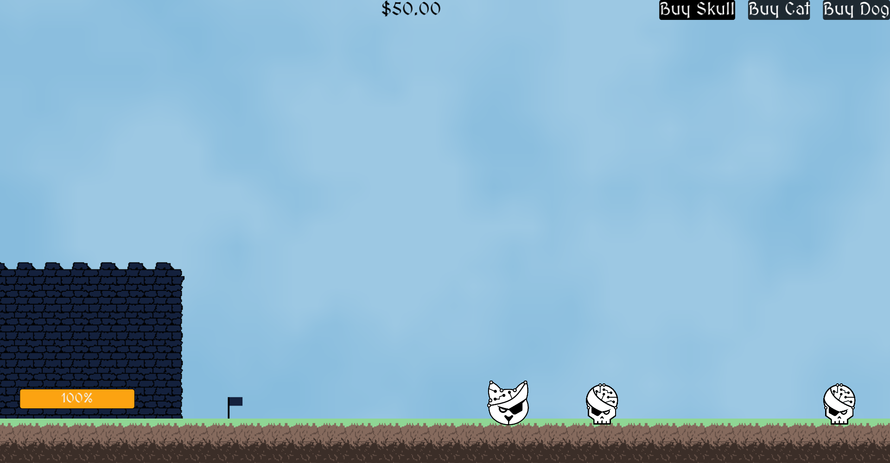

# Age of Pwn

- Category: Pwn
- Difficulty: Difficult
- Number of solves: 1

This is the second pwn challenge I created with [Lukas](https://github.com/hertelukas), this time for [Advanced Binary Exploitation](https://www.sec.in.tum.de/i20/teaching/ws-2023/advanced-binary-exploitation). It is a multiplayer game heavily inspired by Age of War, which I played a lot as a kid. The goal here was to pwn the server using the [Blind ROP technique](https://www.scs.stanford.edu/brop/bittau-brop.pdf).

Players receive only the [game client](./dist.zip) and a Readme giving some information about the server.

## Analyzing the client

The client shows a parody of Age of War, where you can either play locally against a bot, or online with another player:

When winning a game, we get a link to the [Blind ROP paper from Bittau et al.](https://www.scs.stanford.edu/brop/bittau-brop.pdf). So we will have to do Blind ROP on the server.
The client is written in Godot, and I built it with debug symbols and C# scripts in clear, so reverse-engineering of the client is fairly easy with [gdsdecomp](https://github.com/GDRETools/gdsdecomp) or even just with `strings`. Reversing the client reveals the network protocol used to create and join a lobby, and then to send commands to the server and receive updates every tick. Each packet is preceded by its size, but most of the packets are less than 32 bytes, so we can try sending a bigger packet to see what happens... and the server crashes!

## Blind ROP attack

I would highly recommend you to read the Blind ROP paper before reading this.
To perform a blind ROP attack, we need:
- a server that forks at every new connection, keeping the same ASLR and canary -> this is probably the case for our server
- a stack based buffer overflow vulnerability -> we have one for large packet sizes
- a way to distinguish crashes from hangs, or at least two different behaviors that we can trigger and distinguish -> more on this later, but we will use the tick updates or `OPPO_BUY_UNITS` packets instead of the hangs

Our exploit will be a bit different from the classical Blind ROP, because we have two sockets talking with the server (one for each player). When developing the exploit, I made my best not to use my knowledge of the server, and only make reasonable assumptions, which was not easy, and I was afraid the challenge would not be solvable because I "cheated" somewhere and used what I knew about the server. Fortunately, someone managed to flag it, so it means I did not fail on that point :-).

The [exploit](./exploit.py) is quite large and contains many functions, let's review them.

First, we have some helpers for sending and receiving packets of different types, and performing the initial lobby creation/join with the server.

`find_buf_length` bruteforces the length of the padding before the canary. One player sends a "BUY_UNIT" packet with increasing length, and we note when the other player stops receiving "OPPO_BUY_UNIT" packets. We find that the padding has a length of **40**

`bf_stack` performs stack reading by testing every possible value for each byte on the stack, and records the one that does not cause a crash, allowing use to read the stack byte by byte.
Once we know the structure of what we read, we can create a new function, `bf_stack_faster`, that skips the value we already know.
We identify the following elements on the stack:
- canary
- 8 bytes whose value is not relevant (no crash, whatever the value is), probably here for padding
- a value that could look like a return address, but is actually saved RBX, used to hold the mutex address. This one was tricky, but we could realize it that many values would not cause a crash here, including the page-aligned one, so it is not likely to be the return address
- 8 other irrelevant bytes, which are actually the saved RBP, but do not cause a crash instantly
- saved RIP: has not so many candidate values, and is a few pages before the saved RBX from before

The stack reading is the only step that must be done every again every time the server reboots.

We then used the `bf_stack` function to see what other return addresses would give as output, and managed to find an address that consistently sends a tick update: this is the address we will use a "stop gadget" (cf the paper).

We then need to find a BROP gadget ("pop rbx; pop rbp; pop r12; pop r13; pop r14; pop r15; ret"), which used to be famous for the ret2csu attack. `libc_csu_init` does not exist anymore, but this gadget still appears frequently when compiling programs with `-O3`. For this, we use the `find_brop_gadget` functions, which places "TICK"s (the address we found previously that consistently sends a tick update) and "TRAP"s (`0xdeadbeefcafebabe` to crash the program instantly) in a specific pattern that will make most gadgets crash, but not the BROP gadget. This gives us many possible candidates, so we also test a pattern that crashes the BROP gadget in order to skim out false positives. This way, we find two candidates.

We then use `is_brop_gadget` to make sure that they are BROP gadgets, by testing different patterns on all the "subgadgets" of this gadget. Thanks to this BROP gadget, we have a "pop rdi; ret" and a "pop rsi; pop r15; ret" gadget.

Next step is to find `strcmp` in the PLT in order to be able to set RDX. For this, we use the strategy of the paper: `strcmp` should work crash when one or two of its arguments is not readable, and work when both are readable. We can thus scan the beginning of the PLT (taken as the start of the text section we leaked), until we find it. So now we can set RDX to a non-zero value by calling `strcmp` on two different readable addresses.

Then we must find `write` or `send` in the PLT to leak the binary. For this we need to know the file descriptor of our player socket. The BROP paper says we can bruteforce it, but we can actually find it logically, knowing that they must start from zero and increase each time a new one is needed. We should thus have:
0: stdin
1: stdout
2: stderr
3: server socket
4: player 0 socket
5: player 1 socket
We then scan the PLT again, and find the address of `write` or `send`.

Knowing the address of `write`, we can then leak the whole server binary by writing it to one our player socket.
We open it in a disassembler, and find the addresses of libc functions in the GOT. Using https://libc.rip, we can find the libc used by the server: https://libc.rip/download/libc6_2.35-0ubuntu3.6_amd64.so. We also obtain the address of a few symbols from libc that will interest us for the next step: `dup2`, `system` and "/bin/sh". Once we know the libc, we can use `leak_libc`base` to quickly leak it the next time without dumping the whole server binary.

With all these elements, we can build the final ROP chain, which `dup2` stdin, stdout and stderr to our player socket, then calls `system("/bin/sh")`, and gives us a shell on the server.

Flag: `RM{I_miss_those_good_old_flash_games_a2dac7a7bc7ade01dcc23b88b3da6e74}
`