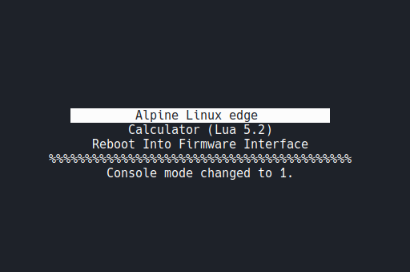
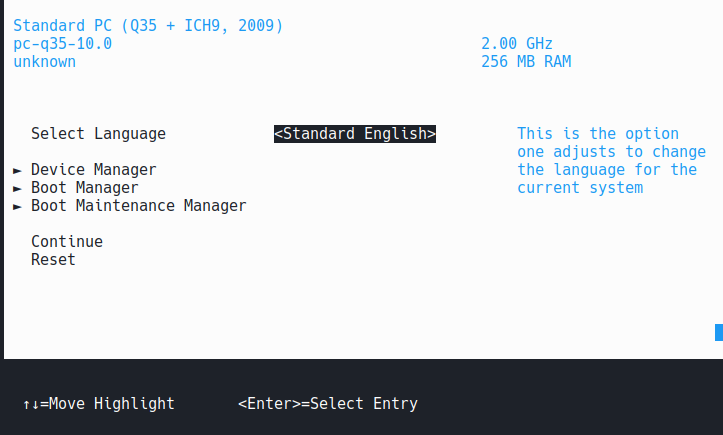
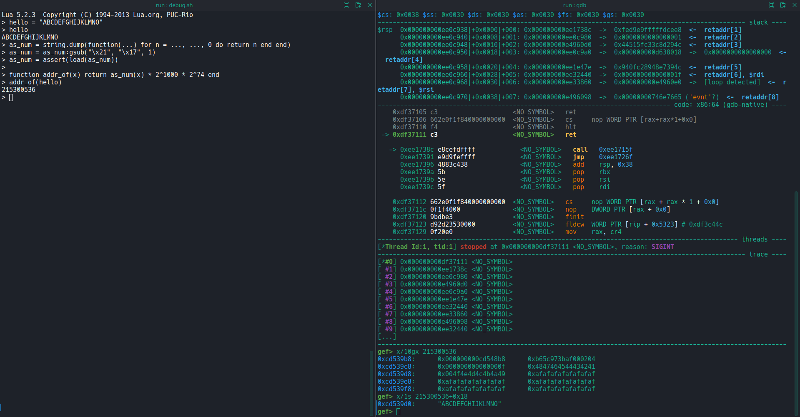

# Lua.efi

- Author: [YiFei Zhu](https://github.com/zhuyifei1999)
- Category: pwn
- Final point value: 426
- Number of solves: 12

## Challenge description


The engineers at SIGPwny Inc. wants to retaliate against PwnySIG Inc. for finding their secrets. They found PwnySIG Inc.'s server and was able to detach its hard drive and replace the kernel with a backdoor-ed kernel.

Unfortunately, they soon discovered that the server has secure boot on, and there's no firmware setup to disable it... how would it be possible to boot this backdoor kernel? Hmm... what's this? How considerate of PwnySIG Inc. to leave a signed lua interpreter wide open. Maybe they can bypass secure boot through that?

Hint: Feel free to use known exploits that exist in the wild to escape the lua "jail", such as https://gist.github.com/corsix/49d770c7085e4b75f32939c6c076aad6

## Discovery

In this challenge, we have access to an [UEFI](https://en.wikipedia.org/wiki/UEFI) boot menu with three boot options: 



Note: somehow on my terminal this menu was completely broken, so I was very confused when starting the challenge, but by randomly mashing the keyboard I discovered that pressing 'R' would change the console mode and make this nice menu appear.

Trying to boot "Alpine Linux edge" results in the following error:

```
../src/boot/boot.c:2560@image_start: Error loading \EFI\Linux\bzImage.uki.efi: Access denied
```

The second option gives a Lua interpreter:

```
Lua 5.2.3  Copyright (C) 1994-2013 Lua.org, PUC-Rio
> 1+1
2
> print "hello world"
hello world
> 
```

And the third option simply closes the connection.

Three folders were given for this challenge, along with a Readme describing their content:
- `chal_build`: the files used to build the challenge. Notably, there is a Dockerfile containing the whole build process: compiling the Linux kernel, generating UEFI keys, compiling [edk2](https://github.com/tianocore/edk2) and [edk2-libc](https://github.com/tianocore/edk2-libc), signing these pieces and bundling them together so that we can run the resulting system. There are also some patches for `edk2` and `edk2-libc`, to improve ASLR in UEFI and to remove most of the `os` and `io` functions from the Lua interpreter. Another important file, which I overlooked at first, is the `init` script of the built Linux image: it mounts the file system containing the flag and prints the flag, which should make it clear that the goal of the challenge is to boot the Linux kernel, if the description wasn't clear enough.
- `edk2_artifacts`: EDK2 OVMF build artifacts containing debugging symbols of
  each UEFI module
- `run`: the pre-built file in order to run the challenge locally. There is a `rootfs` (with the Lua module, the kernel bzImage, and a `BOOTX64.efi` file), a `secret` folder with a placeholder flag, two [OVMF](https://github.com/tianocore/tianocore.github.io/wiki/OVMF-FAQ) files, and the `run.sh` script running QEMU with all the required options.

In addition to this, the author gave "a minor debugging help" on discord:
> Take a look at how edk2debug.log is generated in "SMM Is Asleep". This file will show the base address of where the images are loaded in that run. For example, if you see `Loading driver at 0x0001CC89000 EntryPoint=0x0001CC8B165 Lua.efi`, the base address of Lua.efi is 0x0001CC89000. And with the base address, in GDB do `add-symbol-file Lua.debug -o 0x0001CC89000` Note that in this challenge ASLR is enabled, so the base address will probably change each time.

I cloned the repos from `edk2` and `edk2-libc` and checked out the right commits in order to understand what was happening. This was my first UEFI pwn challenge, so I didn't really know what to do. So I gave a read at a [writeup](https://towerofhanoi.it/writeups/2022-08-15-uiuctf-2022-smm-cowsay/) of UEFI challenges from the same author, which I remembered seeing in UIUCTF2022. Then I decided to start with the provided hint: the Lua exploit.

## Escaping Lua

By playing around in the Lua toplevel, I discovered that when a function is called without arguments, its address in memory is printed:

```
Lua 5.2.3  Copyright (C) 1994-2013 Lua.org, PUC-Rio
> print
function: 0xcd0c13e
> 
```

So, ASLR is easy to break, that's a good point. I tried to run the suggested [Lua exploit](https://gist.github.com/corsix/49d770c7085e4b75f32939c6c076aad6), removed some `local` keywords at the beginning of function and variable declarations because Lua was complaining about not finding them, and ran it. It crashed, as expected:

```
> ll_loadlib = make_CClosure(0xDEADBEEF)
> ll_loadlib()
!!!! X64 Exception Type - 06(#UD - Invalid Opcode)  CPU Apic ID - 00000000 !!!!
RIP  - 00000000E000000B, CS  - 0000000000000038, RFLAGS - 0000000000010296
RAX  - 000000000D656108, RCX - 000000000CD6D188, RDX - 000000000CD6D2C8
RBX  - 000000000D656038, RSP - 000000000EB98CF8, RBP - 000000000EB98D40
RSI  - 000000000CD6D178, RDI - 000000000D656038
R8   - 000000000080001E, R9  - 000000000CD6D178, R10 - 0000000000000000
R11  - 0000000000000000, R12 - 00000000DEADBEEF, R13 - 00000000FFFFFFFF
R14  - 000000000CD6D178, R15 - 0000000000000000
DS   - 0000000000000030, ES  - 0000000000000030, FS  - 0000000000000030
GS   - 0000000000000030, SS  - 0000000000000030
CR0  - 0000000080010033, CR2 - 0000000000000000, CR3 - 000000000E801000
CR4  - 0000000000000668, CR8 - 0000000000000000
DR0  - 0000000000000000, DR1 - 0000000000000000, DR2 - 0000000000000000
DR3  - 0000000000000000, DR6 - 00000000FFFF0FF0, DR7 - 0000000000000400
GDTR - 000000000E5CC000 0000000000000047, LDTR - 0000000000000000
IDTR - 000000000DD7F018 0000000000000FFF,   TR - 0000000000000000
FXSAVE_STATE - 000000000EB98950
```

I didn't understand the exploit at all, but it worked. Easy, then I just need to open a shell, and I can read the flag... right? The exploit says "Obtaining the address of `ll_loadlib` is left as an exercise to the reader", but it's very easy, since we can leak ASLR by typing in a function without its arguments. So I indeed managed to call `ll_loadlib`, but I did not know what to pass as arguments. Reading the [source code](https://github.com/tianocore/edk2-libc/blob/27545cb7cf32077331bcac0e008115467f5e4c53/AppPkg/Applications/Lua/src/loadlib.c#L286), I understood you had to give the path to a library and the name of a function from this library, and you would get access to this function in Lua. Easy, we just need to call `system` from the libc, then. But... this is UEFI, and there does not seem to be a `libc.so` file lying around.

I tried to understand how the exploit works: it patches the bytecode of functions to modify their behavior, and ultimately lets you call an arbitrary function, with the Lua state as first argument. These functions usually read the actual arguments from the stack in the Lua state. I spent quite some time looking at the source code from edk2-libc and edk2, trying to understand which function I could call to get a UEFI shell, but I couldn't find anything satisfactory.
Then I noticed I could change some arguments passed to QEMU in order to get a better understanding of what was happening. I removed the two following arguments:

```
  -fw_cfg name=opt/org.tianocore/FirmwareSetupSupport,string=no \
  -fw_cfg name=opt/org.tianocore/EFIShellSupport,string=no \
```

And then I had access to Firmware Setup Menu after two failed boots on the Linux entry:


I explored the different options, but did not find a way to get an UEFI shell. But I found a way to browse the file system, when choosing to boot from a specific file, and that's how I made two terrible discoveries:
- there is definitely no libc in this file system
- there is no flag either

Indeed, I had completely misunderstood the goal of the challenge, by overlooking the description and the `init` script: the goal is not to get a shell in UEFI, but to boot the unsigned Linux kernel. I tried disabling Secure Boot from the Firmware Setup Menu, but it did not work.

## Bypassing secure boot

I had no idea on how to bypass secure boot, so I searched the web and fell upon a [article](https://securityaffairs.com/171606/malware/bootkitty-logofail-flaws.html) talking about a Bootkit. I searched the article to find how the bootkit bypassed secured boot, and found this:

> Bootkitty bypasses UEFI Secure Boot by patching integrity verification functions in memory, allowing seamless Linux kernel booting.

Wait a moment, they *patch* functions? So the memory is RWX? I checked the memory mapping in gef, and noticed that indeed, many pages are RWX, including the one containing the `Lua.efi` module! So I can actually write a shellcode.

To write a shellcode, I created a string a Lua and looked at it in GDB:



Easy, the string is stored inline, so we can create a string with our shellcode, get the address of the string, and we'll have our shellcode 0x18 bytes after. I tried this with the previously mentioned Lua exploit and an infinite loop shellcode, and observed in GDB that my shellcode was indeed run.

Now we need to patch the authentication of the image. I searched first for the error printed when trying to boot Linux:
```
../src/boot/boot.c:2560@image_start: Error loading \EFI\Linux\bzImage.uki.efi: Access denied
```
But I could not find the corresponding function in edk2. So I looked at the build Dockerfile again, and noticed that I was missing the code from `BOOTX64.EFI`. It was generated from the `systemd-boot`, so I found the source code in [systemd](https://github.com/systemd/systemd/tree/162e5e4a77931e4a7a7c9b6f86f09a70ec52a3e5/src/boot). And in this source code I found the [`image_start`](https://github.com/systemd/systemd/blob/162e5e4a77931e4a7a7c9b6f86f09a70ec52a3e5/src/boot/boot.c#L2527) function. I also looked at the edk2 logs when trying to boot the image:

```
FSOpen: Open '\EFI\Linux\bzImage.uki.efi' Success
[Security] 3rd party image[0] can be loaded after EndOfDxe: PciRoot(0x0)/Pci(0x1F,0x2)/Sata(0x0,0xFFFF,0x0)/HD(1,MBR,0xBE1AFDFA,0x3F,0xFBFC1)/\EFI\Linux\bzImage.uki.efi.
DxeImageVerificationLib: Image is not signed and SHA1 hash of image is not found in DB/DBX.
The image doesn't pass verification: PciRoot(0x0)/Pci(0x1F,0x2)/Sata(0x0,0xFFFF,0x0)/HD(1,MBR,0xBE1AFDFA,0x3F,0xFBFC1)/\EFI\Linux\bzImage.uki.efi
Error: Image at 0000CD66000 start failed: Access Denied
Image Return Status = Access Denied
```

Using these logs, I managed to find a [nice place for patching](https://github.com/tianocore/edk2/blob/6951dfe7d59d144a3a980bd7eda699db2d8554ac/MdeModulePkg/Core/Dxe/Image/Image.c#L1276). I tried to set the return of this call to zero in GDB, and I managed to boot the Linux kernel.

Now I only needed to write a shellcode that replaces this call with a `xor eax, eax`. To do this I needed the address of the DxeCore module. Looking at how the code was flowing from `image_start` to this call, I found the following flow:
- get address of Lua.efi from the stack (return address)
- BOOTX64.EFI is at a fixed offset from Lua.efi
- [`shim_load_image`](https://github.com/systemd/systemd/blob/4fb09adec47b733afe26eb31d140e74ad10bbd33/src/boot/shim.c#L117) calls the [`LoadImage`](https://github.com/systemd/systemd/blob/4fb09adec47b733afe26eb31d140e74ad10bbd33/src/boot/efi.h#L315) function from a `EFI_BOOT_SERVICES` object, this function lies in DxeCore -> follow this pointer to get the address of DxeCore
- patch the call to `gSecurity2->FileAuthentication`

The corresponding assembly can be found [here](./payload.s). I wrote a small [python script](./gen_payload.py) to make a full Lua exploit from it, because I had to test it and modify it several times to get it to work. Then we can run the exploit, it runs without a crash. We can then quit the Lua interpreter with `os.exit(0)`, and try to boot the Linux kernel:

```
+ mkdir -p /proc /dev /sys /etc /mnt
+ mount -n -t proc -o nosuid,noexec,nodev proc /proc/
+ mount -n -t devtmpfs -o 'mode=0755,nosuid,noexec' devtmpfs /dev
+ mount -n -t sysfs -o nosuid,noexec,nodev sys /sys
+ mount -n -t tmpfs -o 'mode=1777' tmpfs /tmp
+ mount -n -t 9p flag -o 'nosuid,noexec,nodev,version=9p2000.L,trans=virtio,msize=104857600' /mnt
+ cat /mnt/flag
uiuctf{broken_chain_of_trust_is_a_lot_of_damage_fb61a3b1}
+ sleep 10
```

And that's a flag!

## Conclusion

I spent a whole day on this challenge, but it was worth it. I learned a lot about UEFI and Lua, and I was very proud to flag it. Many thanks to the author, I hope to see UEFI challenges again in CTFs!